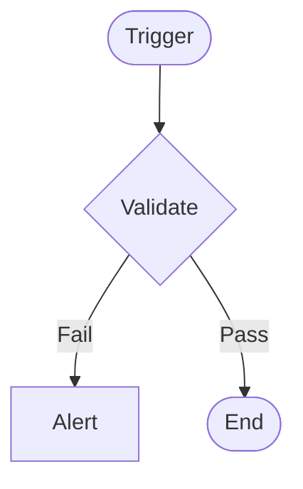

**Postman Documentation:** [Link to API Collection Placeholder]

---

## Overview
[Provide a high-level description of the function's purpose, its trigger, and its overall role within the Cordulus ecosystem.]

## Technical Contract
- **Input:** [Identify the input parameters]
- **Output:** [Identify the return value or side effects]
- **Primary Entities:** [List the main Zoho modules or external entities involved]

## Dependency Map
This script orchestrates the following internal functions and external services:

| Function / Service | Purpose | Criticality |
| --- | --- | --- |
| [[Feature Aggregator]] | [Example Purpose] | [Example Criticality] |

## Logic Flow
[Describe the script's architectural logic using a Mermaid diagram.]

## Core Logic Sections
[Breakdown the script into its primary logical pillars or stages.]

### 1. [Logic Pillar Name]
[Detailed description]

## Developer Notes
[Identify potential weak points, performance risks, or logical edge cases in the script. Use GitHub Alerts appropriately.]

## Change Log
- **{{timestamp}}:** Initial creation of documentation via DeluluDocu.
