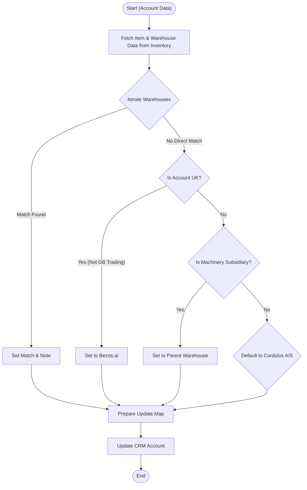

**Postman Documentation:** [Link to API Collection Placeholder]

---

## Overview
The `delugeZohoInventoryGetWarehouseId` function is designed to bridge Zoho Inventory and Zoho CRM. Its primary purpose is to identify the most appropriate Warehouse ID for a specific CRM Account based on the account's name and geographic location. It fetches warehouse availability from a master item in Zoho Inventory, applies business logic to select a warehouse, and updates the Account record in CRM with the resulting metadata. This ensures that sales orders or inventory operations related to the account are routed to the correct logistics hub.

## Technical Contract
- **Input:** 
    - `String account_name`: The name of the Account in CRM.
    - `Int account_id`: The unique ID of the Account in CRM (used for the update).
    - `String country`: The country associated with the Account.
- **Output:** Side effect: Updates the "Accounts" module in Zoho CRM with `Warehouse_ID`, `Warehouse_Name`, and `Warehouse_Note`.
- **Primary Entities:** 
    - `Zoho Inventory`: Items & Warehouses.
    - `Zoho CRM`: Accounts.

## Dependency Map
This script orchestrates the following internal functions and external services:

| Function / Service | Purpose | Criticality |
| --- | --- | --- |
| `zoho.inventory.getRecordsByID` | Retrieves warehouse-specific data for a hardcoded master item. | High |
| `zoho.crm.updateRecord` | Updates the Account record with matched warehouse details. | High |

## Logic Flow

## Core Logic Sections

### 1. Inventory Data Retrieval
The script initiates by fetching details for a specific "master item" (IDs `20087400261` and `389902000050438236`). This is done to access the `warehouses` list associated with that item, which serves as the source of truth for available warehouse names and IDs.

### 2. Matching Heuristics
The script iterates through the retrieved warehouses and applies three levels of logic:
- **Direct Match:** Checks if `warehouse_name == account_name`.
- **Subsidiary Logic:** If the account contains "Machinery", it attempts to match the prefix of the name to a warehouse.
- **Geographic Logic:** If the country is "United Kingdom" (and not a specific trading group), it routes to "Bezos.ai".

### 3. Default Fallback
If no logic-based match is found, the script performs a secondary loop to locate "Cordulus A/S". This serves as the global fallback warehouse to ensure the CRM record is not left with ambiguous data.

### 4. CRM Synchronization
The final stage constructs a map containing the ID, Name, and a Note describing how the warehouse was selected. This is pushed to the CRM `Accounts` module using the provided `account_id`.

## Developer Notes

> [!WARNING]
> This script contains hardcoded Item IDs and Organization IDs for Zoho Inventory (`20087400261`, `389902000050438236`). If the master item is deleted or the Inventory organization changes, this script will fail.

> [!CAUTION]
> The "Machinery" matching logic uses `substring` and `indexOf`. If the `account_name` does not strictly follow the expected naming convention (e.g., "Company Machinery"), the substring calculation might throw an error or return incorrect results.

> [!TIP]
> The `warehouse_note` field is particularly useful for debugging, as it explains *why* a specific warehouse was assigned (e.g., "Matched a UK company to Bezos.ai").

## Change Log
- **2026-03-19T16:06:29.580Z:** Initial creation of documentation via DeluluDocu.