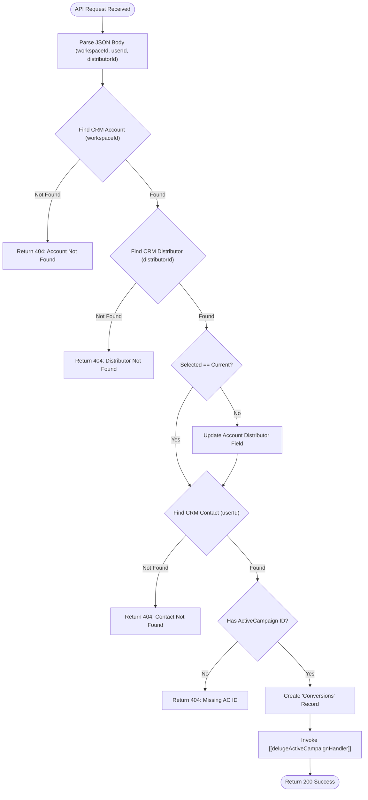

**Postman Documentation:** [Link to API Collection Placeholder]

---

## Overview
The `delugeMobileAppRequestAQuote` function serves as an API entry point for the Cordulus Farm mobile application. When a user requests a quote via the app, this script synchronizes the selected distributor to the user's CRM Account, creates a tracking record in the "Conversions" module, and triggers a marketing automation update in ActiveCampaign via a secondary handler.

## Technical Contract
- **Input:** `String crmAPIRequest` (A JSON-formatted string containing `workspaceId`, `userId`, and `distributorId`).
- **Output:** `Map` (containing `crmAPIResponse` with HTTP status codes 200 or 404 and a corresponding JSON body).
- **Primary Entities:** 
    - **Accounts:** Queried by `Kanisa_Farm_ID` and `Populace_Distributor_ID`.
    - **Contacts:** Queried by `Kanisa_User_ID`.
    - **Conversions:** A custom module record created to track "Request a Quote" events.
    - **ActiveCampaign:** Updated via internal script call.

## Dependency Map
This script orchestrates the following internal functions and external services:

| Function / Service | Purpose | Criticality |
| --- | --- | --- |
| [[delugeActiveCampaignHandler]] | Synchronizes the conversion event and tags to the ActiveCampaign platform. | High |
| Zoho CRM (Search/Update/Create) | Standard CRUD operations for Accounts, Contacts, and Conversions. | Critical |

## Logic Flow

## Core Logic Sections

### 1. Entity Matching & Validation
The script performs a series of lookups to translate external Mobile App IDs into Zoho CRM internal IDs. It validates the existence of the Account (via `workspaceId`), the Distributor (via `distributorId`), and the Contact (via `userId`).

### 2. Distributor Synchronization
If the distributor selected in the mobile app does not match the distributor currently associated with the CRM Account, the script updates the Account's `Distributor_Lookup` field to maintain data consistency between the app and the CRM.

### 3. Conversion Attribution
A new record is created in the **Conversions** module with the following hard-coded attributes:
- **Name:** "Request a Quote Conversion"
- **UTM_Source:** "Cordulus Farm Mobile App"
This provides the sales team with visibility into lead sources and user intent.

### 4. ActiveCampaign Integration
The script constructs a list of tags (`Request a Quote Conversion`, `Mobile App`) and invokes the [[delugeActiveCampaignHandler]]. This ensures the marketing team can trigger follow-up emails based on the "Request a Quote" event.

## Developer Notes

> [!CAUTION]
> The script returns a `404` error if the Contact does not have an `ActiveCampaign_Contact_ID`. If ActiveCampaign synchronization is delayed or failed during contact creation, this mobile app request will fail.

> [!IMPORTANT]
> This script uses a hard-coded mapping for UTM parameters (`UTM_Source = "Cordulus Farm Mobile App"`). Any changes to attribution naming conventions must be updated here manually.

> [!TIP]
> The distributor lookup uses the custom field `Populace_Distributor_ID`. Ensure this field is indexed in CRM for optimal search performance.

## Change Log
- **2026-03-19T16:07:07.587Z:** Initial creation of documentation via DeluluDocu.