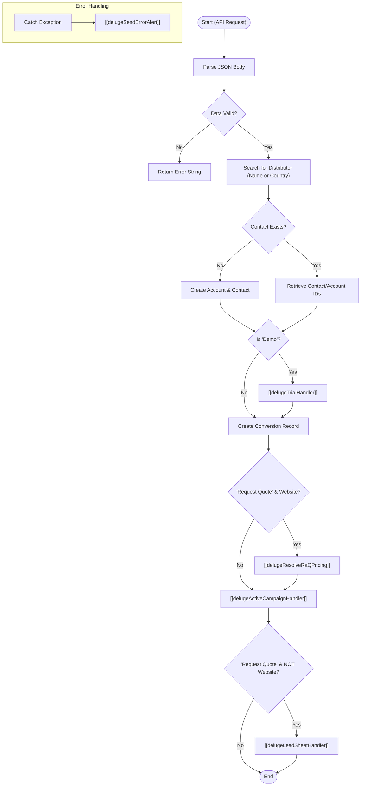

**Postman Documentation:** [Link to API Collection Placeholder]

---

## Overview
The `delugeLeadHandler` is the central orchestration script for processing inbound leads from external sources (such as web forms or advertising platforms) via an API request. It acts as a router and manager that handles data parsing, distributor assignment, record creation in Zoho CRM (Accounts, Contacts, and the custom Conversions module), and triggers downstream integrations for trial management, marketing automation (ActiveCampaign), and external lead sheets.

## Technical Contract
- **Input:** `String crmAPIRequest` (A JSON string containing the payload, typically passed from a Zoho CRM Function URL or Webhook).
- **Output:** `String` (Returns an empty string on success or "Error" on failure).
- **Primary Entities:** 
    - `Accounts` (Distributors and Lead Organizations)
    - `Contacts`
    - `Conversions` (Custom Module)
    - `ActiveCampaign` (External Service)

## Dependency Map
This script orchestrates the following internal functions and external services:

| Function / Service | Purpose | Criticality |
| --- | --- | --- |
| [[delugeTrialHandler]] | Manages the creation of trial subscriptions if the lead is requesting a Demo. | High (for Demos) |
| [[delugeResolveRaQPricing]] | Resolves specific pricing data for Request a Quote conversions from the website. | High |
| [[delugeActiveCampaignHandler]] | Syncs lead data to ActiveCampaign, handles tagging, and list management. Now accepts a Map payload. | High |
| [[delugeLeadSheetHandler]] | Pushes lead data to external Google Sheets for specific distributors (non-website leads). | Medium |
| [[delugeSendErrorAlert]] | Global error handling and notification system. | High |
| `zoho.crm.searchRecords` | Locates existing Contacts, Accounts, and Distributors. | Critical |
| `zoho.crm.createRecord` | Generates new Account, Contact, and Conversion records. | Critical |

## Logic Flow

## Core Logic Sections

### 1. Data Parsing & Name Normalization
The script extracts the `body` from the API request. It handles name splitting logic: if a `fullName` is provided, it splits it into `firstName` and `lastName`. If no space exists, the `lastName` defaults to `-` to satisfy Zoho CRM requirements.

### 2. Distributor Assignment Logic
The script attempts to find a Distributor Account in Zoho CRM using the following priority:
1.  **Direct Name Match:** If a distributor name is provided in the payload.
2.  **Geographic Match:** If no name matches, it searches for an Account where `Billing_Country` matches the lead's country AND `Default_Distributor_for_Country` is checked.
3.  **Fallback:** Defaults to a hardcoded ID for "Cordulus A/S" (520877000145481486).

It now also extracts the `Primary_Contact` lookup from the Distributor account to be used in marketing communications.

### 3. CRM Record Orchestration
The script performs a lookup by email to avoid duplicate contacts. 
- If the contact exists, it retrieves the associated Account.
- If not, it creates a new Account (named after the person if no company is provided) and a new Contact.
- A record is created in the **Conversions** custom module to track marketing UTM data and lead intent.

### 4. Integration Routing
- **Trials:** If the conversion type contains "Demo", it invokes the Trial Handler.
- **Pricing Resolution:** For "Request a Quote" leads coming from the website, it calls `[[delugeResolveRaQPricing]]` to determine relevant pricing tiers based on the distributor.
- **Marketing Automation:** Calls the ActiveCampaign handler using a unified `payload` Map. This syncs lead data, UTM tags, and pricing information.
- **Lead Sheets:** Triggers for "Request a Quote" conversions only if the source is **NOT** "Website" (e.g., Facebook Lead Ads), to avoid duplicate notifications for web leads already handled by automated pricing emails.

## Developer Notes

> [!CAUTION]
> The function signature for `[[delugeActiveCampaignHandler]]` has changed. It now accepts a single `Map` as an argument instead of multiple individual parameters. Ensure any other scripts calling that function are updated to prevent execution errors.

> [!IMPORTANT]
> The Distributor ID for "Cordulus A/S" (520877000145481486) remains hardcoded. If this account is deleted or recreated in the CRM, this script will fail.

> [!NOTE]
> Website "Request a Quote" leads are now excluded from `[[delugeLeadSheetHandler]]`. This assumes that web-based quotes are fully automated via ActiveCampaign and do not require manual entry into distributor sheets.

> [!TIP]
> This script uses a specific list ID mapping for ActiveCampaign: ID `35` for "Farm" vertical and ID `62` for others. Ensure these list IDs in ActiveCampaign remain consistent.

## Change Log
- **2026-03-19T15:58:15.249Z:** Initial creation of documentation via DeluluDocu.
- **2026-03-27T13:28:58.363Z:** Updated logic to include `[[delugeResolveRaQPricing]]`. Refactored `[[delugeActiveCampaignHandler]]` call to use a Map-based payload. Added `utmSource` filtering to the `[[delugeLeadSheetHandler]]` trigger to prevent duplicate processing of website leads. Extracting `Primary_Contact` from Distributor accounts.