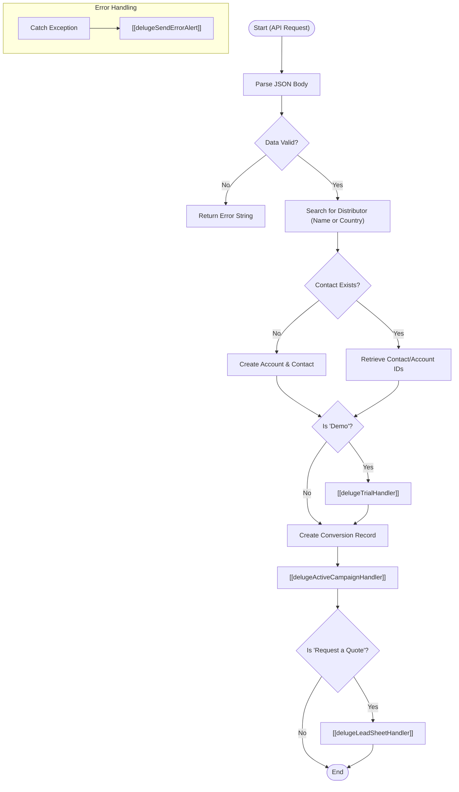

**Postman Documentation:** [Link to API Collection Placeholder]

---

## Overview
The `delugeLeadHandler` is the central orchestration script for processing inbound leads from external sources (such as web forms or advertising platforms) via an API request. It acts as a router and manager that handles data parsing, distributor assignment, record creation in Zoho CRM (Accounts, Contacts, and the custom Conversions module), and triggers downstream integrations for trial management, marketing automation (ActiveCampaign), and external lead sheets.

## Technical Contract
- **Input:** `String crmAPIRequest` (A JSON string containing the payload, typically passed from a Zoho CRM Function URL or Webhook).
- **Output:** `String` (Returns an empty string on success or "Error" on failure).
- **Primary Entities:** 
    - `Accounts` (Distributors and Lead Organizations)
    - `Contacts`
    - `Conversions` (Custom Module)
    - `ActiveCampaign` (External Service)

## Dependency Map
This script orchestrates the following internal functions and external services:

| Function / Service | Purpose | Criticality |
| --- | --- | --- |
| [[delugeTrialHandler]] | Manages the creation of trial subscriptions if the lead is requesting a Demo. | High (for Demos) |
| [[delugeActiveCampaignHandler]] | Syncs lead data to ActiveCampaign, handles tagging, and list management. | High |
| [[delugeLeadSheetHandler]] | Pushes lead data to external Google Sheets for specific distributors. | Medium |
| [[delugeSendErrorAlert]] | Global error handling and notification system. | High |
| `zoho.crm.searchRecords` | Locates existing Contacts, Accounts, and Distributors. | Critical |
| `zoho.crm.createRecord` | Generates new Account, Contact, and Conversion records. | Critical |

## Logic Flow

## Core Logic Sections

### 1. Data Parsing & Name Normalization
The script extracts the `body` from the API request. It handles name splitting logic: if a `fullName` is provided, it splits it into `firstName` and `lastName`. If no space exists, the `lastName` defaults to `-` to satisfy Zoho CRM requirements.

### 2. Distributor Assignment Logic
The script attempts to find a Distributor Account in Zoho CRM using the following priority:
1.  **Direct Name Match:** If a distributor name is provided in the payload.
2.  **Geographic Match:** If no name matches, it searches for an Account where `Billing_Country` matches the lead's country AND `Default_Distributor_for_Country` is checked.
3.  **Fallback:** Defaults to a hardcoded ID for "Cordulus A/S" (520877000145481486).

### 3. CRM Record Orchestration
The script performs a lookup by email to avoid duplicate contacts. 
- If the contact exists, it retrieves the associated Account.
- If not, it creates a new Account (named after the person if no company is provided) and a new Contact.
- A record is created in the **Conversions** custom module to track marketing UTM data and lead intent.

### 4. Integration Routing
- **Trials:** If the conversion type contains "Demo", it invokes the Trial Handler.
- **Marketing Automation:** Always calls the ActiveCampaign handler to sync lead data and UTM tags.
- **Lead Sheets:** If the conversion type is "Request a Quote", it triggers the Lead Sheet handler to notify distributors via external sheets.

## Developer Notes

> [!CAUTION]
> The Distributor ID for "Cordulus A/S" (520877000145481486) is hardcoded. If this account is deleted or recreated in the CRM, this script will fail.

> [!NOTE]
> The script splits the Full Name by the first space. Middle names will be concatenated into the Last Name field.

> [!TIP]
> This script uses a specific list ID mapping for ActiveCampaign: ID `35` for "Farm" vertical and ID `62` for others. Ensure these list IDs in ActiveCampaign remain consistent.

## Change Log
- **2026-03-19T15:58:15.249Z:** Initial creation of documentation via DeluluDocu.