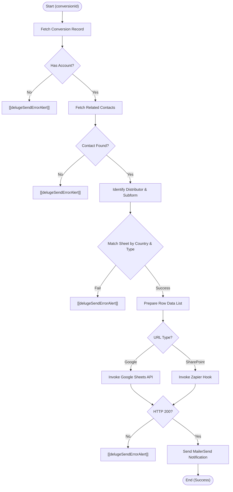

**Postman Documentation:** [Link to API Collection Placeholder]

---

## Overview
The `delugeLeadSheetHandler` function is a centralized integration script used to synchronize lead data from the Zoho CRM **Conversions** module to external spreadsheets managed by Cordulus distributors. 

The script serves as a router: it identifies the appropriate spreadsheet (Google Sheets or SharePoint via Zapier) based on the Distributor's configuration within their Account record, pushes the lead details, and triggers a formatted notification email via the MailerSend API to notify the distributor's sales team.

## Technical Contract
- **Input:** `Int conversionId` - The unique ID of the record in the Conversions module.
- **Output:** `Map` - A structured response containing `success` (boolean), `status` (string), and `message`.
- **Primary Entities:** 
    - **CRM Modules:** Conversions, Accounts, Contacts.
    - **External APIs:** Google Sheets API v4, Zapier Webhooks, MailerSend API.

## Dependency Map
This script orchestrates the following internal functions and external services:

| Function / Service | Purpose | Criticality |
| --- | --- | --- |
| [[delugeSendErrorAlert]] | Handles error logging and notifications to admins when the script fails. | High |
| **Google Sheets API** | Used to append data to Google-based distributor lead sheets. | Medium (Conditional) |
| **Zapier Webhook** | Used as a bridge to push data to SharePoint/Excel lead sheets. | Medium (Conditional) |
| **MailerSend API** | Sends the transactional notification email to the distributor. | Medium |

## Logic Flow

## Core Logic Sections

### 1. Resource Validation
The script first validates the chain of data required for a lead: Conversion -> Account -> Contact. If any link is missing, it terminates and triggers a specialized alert via `[[delugeSendErrorAlert]]`.

### 2. Distributor Spreadsheet Routing
The script navigates to the Distributor's Account record and iterates through a "Spreadsheets" subform. It looks for a row where:
1.  The `Type` matches the lead's type.
2.  The `Country` matches the Account's Billing Country.
3.  **Fallback:** If no country match is found, it looks for a row marked as "Other" (the `defaultAccountCountry`).

### 3. Cross-Platform Data Sync
Based on the `Spreadsheet_URL`:
-   **Google Sheets:** Uses the native Zoho Connection `googlesheets` to call the `/values:append` endpoint.
-   **SharePoint:** Routes the data to a Zapier webhook which handles the authentication and insertion into Microsoft Excel/SharePoint.

### 4. Transactional Notification (MailerSend)
Once the spreadsheet is updated, the script sends a notification. It parses a comma-separated list of emails from the subform to designate a primary "To" recipient and subsequent "CC" recipients.

## Developer Notes

> [!IMPORTANT]
> This script requires two active Zoho CRM Connections: `googlesheets` (with Spreadsheet read/write scopes) and `mailersend` (configured as a Webhook/Generic connection with the appropriate API Token headers).

> [!WARNING]
> **CC List Logic:** The current loop for CC recipients (`for each email in ccEmails { ccList = {{"email":email}}; }`) effectively overwrites the `ccList` variable. As a result, only the *last* email in the CC list will actually be included in the email. This should be updated to `.add()` if multiple CCs are required.

> [!TIP]
> Phone numbers are prepended with a single quote (`'`) before being pushed to spreadsheets. This is a deliberate design choice to prevent spreadsheet applications from truncating leading zeros or formatting the phone number as a mathematical integer.

> [!CAUTION]
> The "Region" logic is hardcoded for specific distributors (`Hankkija Oy`, `Danish Agro`, `Baltic Agro Estonia`). If new distributors require regional filtering based on UTM Ad Set names, they must be added to the `regionColumnDistributors` list.

## Change Log
- **2026-03-19T15:58:37.329Z:** Initial creation of documentation via DeluluDocu.