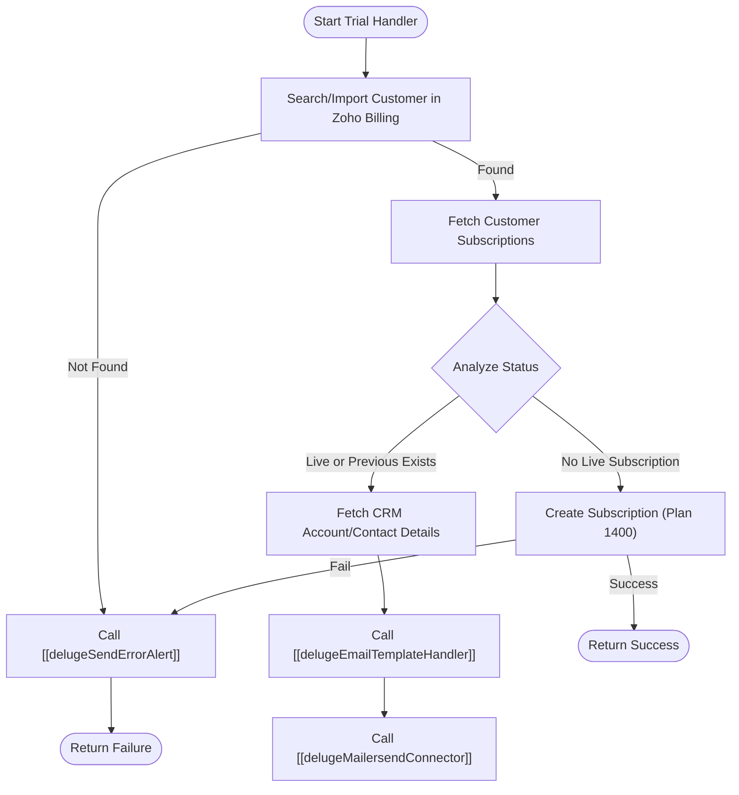

**Postman Documentation:** [Link to API Collection Placeholder]

---

## Overview
The `delugeTrialHandler` script manages the entry point for users requesting a trial or starting a subscription. It acts as a bridge between Zoho CRM and Zoho Billing to ensure that customers are correctly identified. If a customer already has an active or previous subscription history, it prevents duplicate trials and sends a notification email via MailerSend. If no active subscription exists, it automatically provisions a new trial subscription using a predefined plan code.

## Technical Contract
- **Input:** 
    - `zcrmAccountId` (Int)
    - `zcrmContactId` (Int)
    - `customerEmail` (String)
- **Output:** `Map` (containing `success` boolean, `status` string, and optional `subscriptionId` or `message`).
- **Primary Entities:** 
    - Zoho CRM (Accounts & Contacts)
    - Zoho Billing (Customers & Subscriptions)
    - MailerSend (Transactional Email)

## Dependency Map
This script orchestrates the following internal functions and external services:

| Function / Service                           | Purpose                                                                 | Criticality |
| -------------------------------------------- | ----------------------------------------------------------------------- | ----------- |
| [[delugeSendErrorAlert]]                     | Reports failures to the developer team via email/Slack.                 | High        |
| [[delugeEmailTemplateHandler]]               | Retrieves specific MailerSend template IDs based on event and language. | Medium      |
| [[delugeMailersendConnector]]                | Dispatches transactional emails through the MailerSend API.             | Medium      |
| Zoho Billing API                             | Manages customer records and subscription provisioning.                 | High        |
| [[triggerWorkspaceAndPermissionsHandlerCrm]] | Downstream function in Z                                                |             |

## Logic Flow

## Core Logic Sections

### 1. Customer Identification & Import
The script attempts to find or sync the Zoho CRM Account into Zoho Billing using the `zcrm_account_id` reference. This is a critical first step; if the billing record cannot be established, the process halts to prevent orphaned subscriptions.

### 2. Subscription State Analysis
The script iterates through all subscriptions associated with the Billing Customer. It tracks two flags:
- `hasLiveSubscription`: User is currently active.
- `hasPreviousSubscription`: User has an expired or cancelled history.

### 3. Conditional Branching
- **Existing User Branch:** If the user has any subscription history, the script retrieves their preferred language from the CRM Account and sends an "Account Already Exists" email to guide them toward logging in rather than starting a new trial.
- **New User Branch:** If no live subscription is detected, the script calls the Zoho Billing API to create a new subscription under `plan_code: 1400`.

## Developer Notes

> [!IMPORTANT]
> The Zoho Billing Organization ID (`20087400261`) and the Plan Code (`1400`) are currently hardcoded. If moving between Sandbox and Production environments, these must be verified.

> [!WARNING]
> The script uses a specific Deluge connection named `"zohobillingconnection"`. Ensure this connection has the required scopes for `ZohoSubscriptions.customers.CREATE` and `ZohoSubscriptions.subscriptions.CREATE`.

> [!NOTE]
> The email logic includes a hardcoded BCC address (`q0dz604t_8u6v36af@mails2.eu.zohocrm.com`) used for CRM Email BCC tracking.

## Change Log
- **2026-03-19T15:59:14.178Z:** Initial creation of documentation via DeluluDocu.