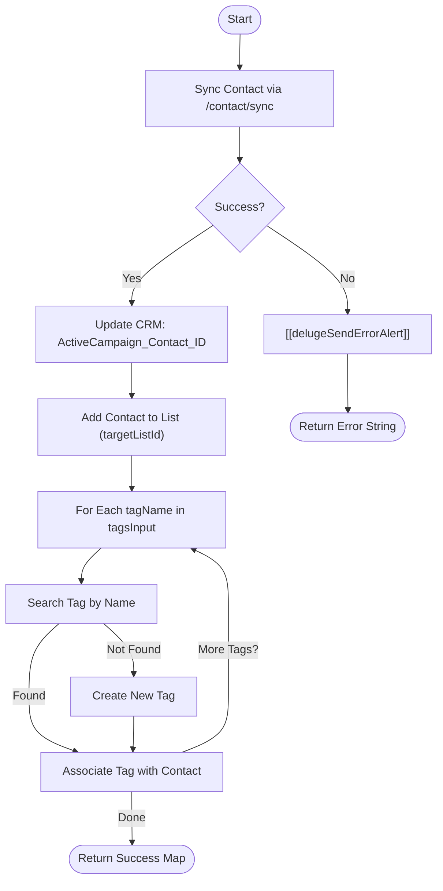

**Postman Documentation:** [Link to API Collection Placeholder]

---

## Overview
The `delugeActiveCampaignHandler` function is a centralized utility designed to synchronize Zoho CRM Contact data with ActiveCampaign. It performs a multi-step orchestration: syncing contact details (including custom fields and UTM parameters), updating the Zoho CRM record with the external ActiveCampaign ID, subscribing the contact to a specific mailing list, and dynamically managing contact tags (searching for or creating tags as needed).

## Technical Contract
- **Input:** 
    - `contactId` (Int): Zoho CRM Contact Record ID.
    - `accountId` (String): Associated Account ID.
    - `firstName`/`lastName`/`email`/`phone` (String): Standard identity fields.
    - `country`/`distributorName` (String): Geographic and organizational metadata.
    - `activeCampaignContactId` (String): Existing AC ID if known.
    - `tagsInput` (List/String): A collection of tag names to apply.
    - `conversionName`/`conversionId` (String): Marketing conversion tracking.
    - `utmSource`/`utmMedium`/`utmCampaign` (String): Standard UTM parameters.
    - `targetListId` (String): The ActiveCampaign List ID for subscription.
- **Output:** Returns a Map `{"success":true, "acContactId": "..."}` on success, or a string error message on failure.
- **Primary Entities:** Zoho CRM Contacts, ActiveCampaign API (v3).

## Dependency Map
This script orchestrates the following internal functions and external services:

| Function / Service | Purpose | Criticality |
| --- | --- | --- |
| [[delugeSendErrorAlert]] | Dispatches error notifications to developers/admins upon API failure. | High |
| ActiveCampaign API (v3) | External service for marketing automation and contact management. | Mission Critical |
| Zoho CRM (Contacts) | Data source and destination for the ActiveCampaign Contact ID. | High |

## Logic Flow

## Core Logic Sections

### 1. Contact Synchronization & Custom Field Mapping
The script uses the ActiveCampaign `/contact/sync` endpoint, which acts as an "upsert" mechanism based on the email address. It maps a significant number of custom fields (IDs 1, 3, 4, 11, 5, 2, 47, 48, 49, 60) to capture CRM IDs, distributor info, and marketing attribution data.

### 2. CRM ID Write-back
Immediately following a successful sync, the script extracts the ActiveCampaign Contact ID and updates the `ActiveCampaign_Contact_ID` field in the Zoho CRM Contacts module. This ensures future parity and easier lookups.

### 3. List Subscription
The contact is subscribed to the `targetListId` provided in the arguments. The status is explicitly set to `"1"` (Active/Subscribed).

### 4. Dynamic Tag Management
The script iterates through the `tagsInput`. For each tag:
1. It searches the AC system for an existing tag matching the name.
2. If no exact match is found, it creates the tag via the API.
3. It associates the (found or created) Tag ID with the contact.

## Developer Notes

> [!IMPORTANT]
> This function requires a valid Zoho CRM Connection named `activecampaign`. Ensure the connection has scopes for both `invokeurl` and CRM record updates.

> [!CAUTION]
> The `tagsInput` parameter is defined as a `String` in the function signature but is iterated over as a `List`. Ensure the calling script passes a List object, or Deluge may throw a runtime error during the `for each` loop.

> [!TIP]
> The UTM Source is specifically mapped twice if the `conversionName` contains the word "Request" (Field ID 60), facilitating specific reporting for Quote Requests.

## Change Log
- **2026-03-19T15:33:47.979Z:** Initial creation of documentation via DeluluDocu.