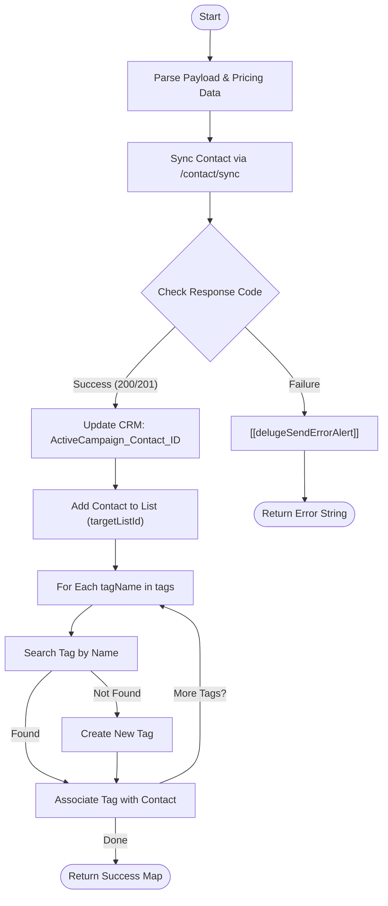

**Postman Documentation:** [Link to API Collection Placeholder]

---

## Overview
The `delugeActiveCampaignHandler` function is a centralized utility designed to synchronize Zoho CRM Contact data with ActiveCampaign. It performs a multi-step orchestration: syncing contact details (including extensive custom fields, marketing attribution, and pricing data), updating the Zoho CRM record with the external ActiveCampaign ID, subscribing the contact to a specific mailing list, and dynamically managing contact tags.

## Technical Contract
- **Input:** 
    - `payload` (String/Map): A comprehensive JSON object containing:
        - Identity: `email`, `phone`, `firstName`, `lastName`.
        - CRM Metadata: `contactId`, `accountId`, `country`.
        - Distribution: `distributorName`, `distributorPrimaryContact`.
        - Marketing: `utmSource`, `utmMedium`, `utmCampaign`, `conversionName`, `conversionId`.
        - Pricing (Optional Map): Nested details from Sales Sprints (`salesSprint`, `priceList`, `savings`).
        - Configuration: `tags` (List), `targetListId` (String).
- **Output:** Returns a Map `{"success":true, "acContactId": "..."}` on success, or a string error message on failure.
- **Primary Entities:** Zoho CRM Contacts, ActiveCampaign API (v3).

## Dependency Map
This script orchestrates the following internal functions and external services:

| Function / Service | Purpose | Criticality |
| --- | --- | --- |
| [[delugeSendErrorAlert]] | Dispatches error notifications to developers/admins upon API failure. | High |
| ActiveCampaign API (v3) | External service for marketing automation and contact management. | Mission Critical |
| Zoho CRM (Contacts) | Data source and destination for the ActiveCampaign Contact ID. | High |

## Logic Flow

## Core Logic Sections

### 1. Payload Extraction & Pricing Logic
The script extracts identity, attribution, and configuration metadata from the `payload`. It includes specialized logic to handle pricing information (Startup Prices, Subscription Prices, and Savings) from a nested `pricing` object.

### 2. Contact Synchronization & Custom Field Mapping
The script uses the ActiveCampaign `/contact/sync` endpoint. It maps a significant number of custom fields:
- **CRM/Base:** IDs 1 (Account), 3 (CRM ID), 4 (Country).
- **Distribution:** IDs 11 (Name), 68 (Primary Contact).
- **Attribution:** IDs 5, 2, 47, 48, 49, 60 (UTMs and Conversion details).
- **Pricing:** IDs 64 (Offer Startup), 62 (Default Startup), 63 (Default Sub), 65 (Offer Sub), 66 (Offer Type), 67 (Total Savings).

### 3. CRM ID Write-back
Immediately following a successful sync, the script extracts the ActiveCampaign Contact ID and updates the `ActiveCampaign_Contact_ID` field in the Zoho CRM Contacts module.

### 4. Dynamic Tag Management
The script iterates through the `tags` list. It performs a lookup for each tag name. If the tag is not found, the script creates it dynamically before associating it with the contact.

## Developer Notes

> [!IMPORTANT]
> **Breaking Change:** The function signature has changed from 16 individual arguments to a single `payload` string/map. All calling scripts must be updated to wrap parameters into a Map.

> [!TIP]
> The pricing logic handles `null` values gracefully via `ifnull`. If the `pricing` map is missing from the payload, the associated ActiveCampaign custom fields will simply be omitted from the sync request.

> [!CAUTION]
> There is a logic syntax error in the response code check: `if(responseCode == 200 || responseCode = 201)`. The use of a single `=` performs an assignment rather than a comparison. While Deluge often evaluates this as true, it should be corrected to `== 201` to prevent unpredictable behavior.

## Change Log
- **2026-03-31T11:51:10.389Z:** 
    - Minor maintenance update. 
    - Enabled `info` logging for `searchTagResp` to assist in debugging Tag lookup failures.
- **2026-03-27T13:28:49.726Z:** 
    - Refactored function signature to accept a single `payload` Map.
    - Added support for 7 new custom fields related to Pricing and Distributor Contacts (IDs 62-68).
    - Implemented nested logic for `pricing` data extraction.
    - Updated error handling to pass the entire payload to [[delugeSendErrorAlert]].
- **2026-03-19T15:33:47.979Z:** Initial creation of documentation via DeluluDocu.