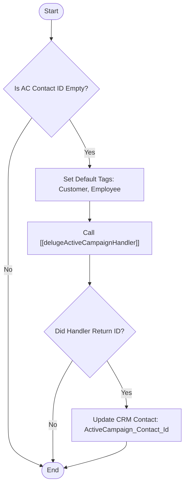

**Postman Documentation:** [Link to API Collection Placeholder]

---

## Overview
The `delugeSyncActiveCampaignContact` function serves as an orchestration layer within the Cordulus ecosystem to ensure Zoho CRM Contacts are synchronized with ActiveCampaign. It specifically targets records that lack an `activeCampaignContactId`, triggers the synchronization handler, and updates the CRM record with the resulting external ID to maintain data parity.

## Technical Contract
- **Input:** 
    - `contactId` (Int): The Zoho CRM Contact record ID.
    - `accountId` (Int): The associated Zoho CRM Account record ID.
    - `firstName` (String): Contact's first name.
    - `lastName` (String): Contact's last name.
    - `email` (String): Contact's email address.
    - `country` (String): Contact's country.
    - `activeCampaignContactId` (String): The existing ID from ActiveCampaign (if any).
- **Output:** `void` (Side effect: Updates Zoho CRM record).
- **Primary Entities:** 
    - Zoho CRM `Contacts` Module.
    - ActiveCampaign Contact records.

## Dependency Map
This script orchestrates the following internal functions and external services:

| Function / Service | Purpose | Criticality |
| --- | --- | --- |
| [[delugeActiveCampaignHandler]] | Manages the direct API integration logic and payload formatting for ActiveCampaign. | High |
| Zoho CRM API | Used to update the contact record with the synced ID. | High |

## Logic Flow

## Core Logic Sections

### 1. Synchronization Trigger Condition
The script first evaluates the `activeCampaignContactId` parameter. It only proceeds with the sync logic if this value is empty, preventing redundant API calls for contacts already mapped to ActiveCampaign.

### 2. Standalone Handler Invocation
The script passes all contact details to the `[[delugeActiveCampaignHandler]]`. 

> [!TIP]
> This script currently assigns a static list of tags (`{"Customer", "Employee"}`) to all synced contacts by default.

### 3. Record Persistence
Upon a successful response from the handler, the script extracts the `acContactId`. It then performs a `zoho.crm.updateRecord` call to write this ID back to the `ActiveCampaign_Contact_Id` field on the Zoho CRM Contact record.

## Developer Notes

> [!WARNING]
> **Data Casting:** The script explicitly converts `contactId` and `accountId` to Long using `.toLong()` when calling the handler. Ensure the input `Int` does not exceed standard integer limits if the CRM ID grows in length, though Zoho Deluge usually handles `Int` as `Long` internally.

> [!IMPORTANT]
> **Response Handling:** The script checks if `syncAcContactResp.get("acContactId") != null`. If the handler returns an error map without this key, the CRM update will be skipped silently. Monitoring the `info` logs is required for debugging failed syncs.

## Change Log
- **2026-03-19T19:33:50.220Z:** Initial creation of documentation via DeluluDocu.