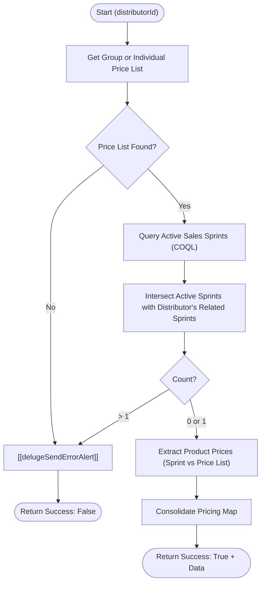

**Postman Documentation:** [Link to API Collection Placeholder]

---

## Overview
The `delugeResolveRaQPricing` function is a standalone utility designed to calculate and resolve the applicable pricing for a distributor. It determines pricing by evaluating two primary sources: the Distributor's assigned **Price List** and any currently **Active Sales Sprints** linked to that distributor. This function ensures that the "Request a Quote" (RaQ) process uses the most accurate and promotional pricing available for Cordulus Farm Stations.

## Technical Contract
- **Input:** `Int distributorId` (The unique ID of the Account/Distributor).
- **Output:** A Map containing `success` (boolean) and `data` (Map of prices) or `error_message` (string).
- **Primary Entities:** `Accounts`, `Price_Lists`, `Sales_Sprints`, `Products`.

## Dependency Map
This script orchestrates the following internal functions and external services:

| Function / Service | Purpose | Criticality |
| --- | --- | --- |
| [[delugeSendErrorAlert]] | Sends notifications to administrators when critical pricing resolution steps fail. | High |
| Zoho CRM API (COQL) | Used to perform complex filtering for active Sales Sprints. | High |

## Logic Flow

## Core Logic Sections

### 1. Price List Resolution
The script first attempts to find a "Related Group Price List" for the distributor. If none exists, it falls back to the individual "Related Price List." If neither is found, the process terminates as pricing cannot be calculated without a base list.

### 2. Active Sales Sprint Identification
The script uses a COQL query to find all globally active Sales Sprints. It then fetches the specific Sales Sprints related to the `distributorId`. By performing an intersection of these two lists, it identifies if the distributor is currently participating in exactly one active promotion.

### 3. Pricing Extraction & Fallback
The script iterates through subforms in both the Sales Sprint and the Price List to find values for "Cordulus Farm Station: Annual Subscription" and "Cordulus Farm Station: Startup Cost." 
- If a Sales Sprint exists, its prices take precedence (Initial Year, Renewal Year).
- If specific values are missing in the Sprint, it falls back to the standard Price List values.

### 4. Sprint Type Classification
The logic classifies the sprint as `standard` or `two for one` based on the `Accrual_Period_in_Months`. A 12-month period is standard, while other values trigger the logic for multi-year pricing structures (Year 1 vs Year 2).

## Developer Notes

> [!CAUTION]
> The script strictly enforces a limit of **one** active Sales Sprint per distributor. If a distributor is associated with multiple active sprints simultaneously, the script will trigger an error alert and fail to resolve pricing.

> [!IMPORTANT]
> Product identification relies on string matching (e.g., `.contains("Cordulus Farm Station: Annual Subscription")`). Ensure product names in the CRM remain consistent to prevent logic breaks.

> [!TIP]
> This function uses a COQL query to bypass potential limitations of standard `searchRecords` when dealing with specific checkbox criteria and large datasets.

## Change Log
- **2026-03-19T20:12:07.388Z:** Initial creation of documentation via DeluluDocu.