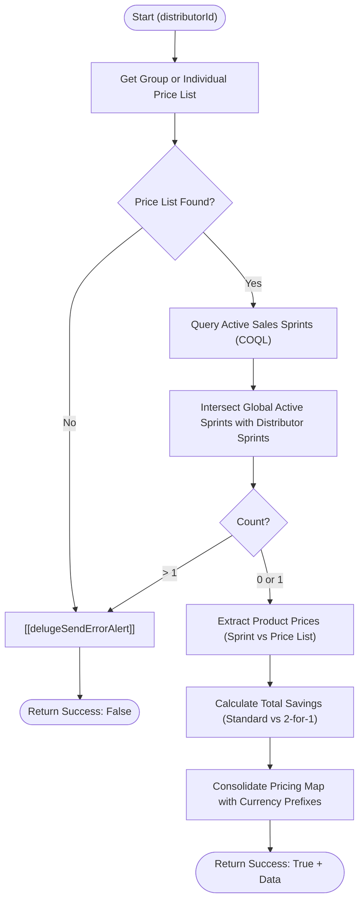

---
| Function ID | Name | Revision Timestamp | Status |
| --- | --- | --- | --- |
| 157805000001362019 | delugeResolveRaQPricing | 2026-03-20T11:59:42.480Z | Functional |

**Postman Documentation:** [Link to API Collection Placeholder]

---

## Overview
The `delugeResolveRaQPricing` function is a standalone utility designed to calculate and resolve the applicable pricing for a distributor. It determines pricing by evaluating two primary sources: the Distributor's assigned **Price List** (Group or Individual) and any currently **Active Sales Sprints** linked to that distributor. This function ensures that the "Request a Quote" (RaQ) process uses the most accurate promotional pricing and calculates potential savings for Cordulus Farm Stations.

## Technical Contract
- **Input:** `Int distributorId` (The unique ID of the Account/Distributor).
- **Output:** A Map containing `success` (boolean) and `data` (Map of prices) or `error_message` (string).
- **Data Structure:** The `data` map returns nested maps for `salesSprint`, `priceList`, and `savings`.
- **Primary Entities:** `Accounts`, `Price_Lists`, `Sales_Sprints`, `Products`.

## Dependency Map
This script orchestrates the following internal functions and external services:

| Function / Service | Purpose | Criticality |
| --- | --- | --- |
| [[delugeSendErrorAlert]] | Sends notifications to administrators when critical pricing resolution steps fail. | High |
| Zoho CRM API (COQL) | Used to perform complex filtering for active Sales Sprints where `Sales_Sprint_Active` is 'Yes'. | High |

## Logic Flow

## Core Logic Sections

### 1. Price List Resolution
The script first attempts to find a "Related Group Price List" for the distributor via `Related_Group_Price_List`. If none exists, it falls back to the individual "Related Price List." If no price list is associated, it returns a critical error as no baseline pricing exists.

### 2. Sales Sprint Intersection
The function identifies active promotions specific to the distributor:
1.  **Global Search:** Uses a COQL query to find all Sprints marked as Active and synced to ActiveCampaign.
2.  **Related Search:** Fetches Sprints explicitly linked to the Account.
3.  **Intersection:** Uses `.intersect()` to find Sprints that are both globally active and linked to the account.
4.  **Validation:** Only one active Sprint is permitted. If multiple are found, the script fails to prevent pricing ambiguity.

### 3. Pricing Extraction & Calculation
The script extracts pricing for two specific products: `Cordulus Farm Station: Annual Subscription` and `Cordulus Farm Station: Startup Cost`.
- **Precedence:** Sales Sprint pricing (Initial Year and First Renewal) takes precedence over the standard Price List.
- **Savings Logic:**
    - **Standard (12 Months):** Savings = (PL Startup - Sprint Startup) + (PL Sub - Sprint Sub Year 1).
    - **Two for One (24 Months):** Savings = (PL Startup - Sprint Startup) + (2 * PL Sub) - (Sprint Sub Year 1 + Sprint Sub Year 2).

### 4. Output Formatting
All numeric values are converted to strings prefixed with the `Currency` code retrieved from the Price List (e.g., "EUR 499").

## Developer Notes

> [!CAUTION]
> The script strictly enforces a limit of **one** active Sales Sprint per distributor. If a distributor is associated with multiple active sprints simultaneously, the script will trigger an error alert and fail.

> [!IMPORTANT]
> **Breaking Change (2026-03-20):** The key for the savings map in the final JSON response has been renamed from `totalSavings` to `savings`. Ensure any front-end or calling script is updated to parse `data.savings.totalSavings`.

> [!IMPORTANT]
> Product identification relies on hardcoded string matching (e.g., `productName == "Cordulus Farm Station: Annual Subscription"`). Any change to product names in the CRM will break the pricing extraction logic.

> [!TIP]
> The `sprintType` is dynamically determined: an `Accrual_Period_in_Months` of 12 is treated as "standard", while 24 (implied by non-12 logic) is treated as "two for one".

## Change Log
- **2026-03-19T20:12:07.388Z:** Initial creation of documentation via DeluluDocu.
- **2026-03-20T11:57:02.240Z:** Logic confirmed/updated. Ensured correct handling of multi-year Accrual Periods (12 vs 24 months) and standardized currency prefixing for returned price maps. Added explicit COQL field selection to documentation.
- **2026-03-20T11:59:42.480Z:** Updated the output map key for the savings data from `totalSavings` to `savings` to maintain naming convention consistency across API responses. No changes to core calculation logic.