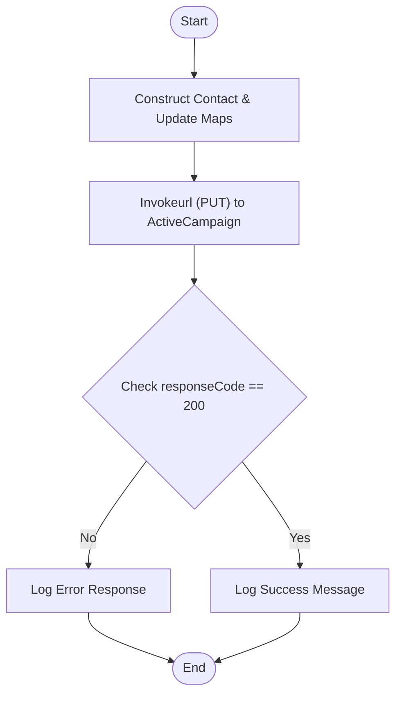

**Postman Documentation:** [Link to API Collection Placeholder]

---

## Overview
The `delugeSyncActiveCampaignContactEmail` function is a utility script within the Cordulus ecosystem designed to synchronize core contact details (First Name, Last Name, and Email) from Zoho to ActiveCampaign. It utilizes the ActiveCampaign API v3 to perform an idempotent update on an existing contact record using their unique ActiveCampaign Contact ID. This ensures that contact information remains consistent across the marketing automation platform and the source CRM.

## Technical Contract
- **Input:** 
    - `String activeCampaignContactId`: The unique internal ID of the contact in ActiveCampaign.
    - `String firstName`: The contact's first name.
    - `String lastName`: The contact's last name.
    - `String email`: The contact's primary email address.
- **Output:** `void` (Side effect: Updates external system and logs results to Deluge console).
- **Primary Entities:** 
    - `ActiveCampaign Contact`
    - `Zoho Deluge (Automation Engine)`

## Dependency Map
This script orchestrates the following internal functions and external services:

| Function / Service | Purpose | Criticality |
| --- | --- | --- |
| ActiveCampaign API v3 | External endpoint for contact management. | High |
| `activecampaign` (Connection) | OAuth2 authorization for API requests. | High |

## Logic Flow

## Core Logic Sections

### 1. Request Payload Preparation
The script initializes a nested Map structure required by the ActiveCampaign API v3. It specifically wraps the contact attributes (`email`, `firstName`, `lastName`) inside a parent key `"contact"`.

### 2. External API Invocation
A `PUT` request is dispatched to the ActiveCampaign `/contacts/{id}` endpoint.
- **URL Construction:** Appends the `activeCampaignContactId` to the base URL.
- **Detailed Flag:** Set to `true` to capture full response headers and codes for debugging.
- **Authentication:** Relies on the Zoho Connection named `"activecampaign"`.

### 3. Response Handling
The script evaluates the `responseCode`. Unlike a POST request which might return 201, a successful PUT update expects a `200` status code. The script provides feedback to the execution logs based on this outcome.

## Developer Notes

> [!IMPORTANT]
> This script performs a `PUT` request, which in the ActiveCampaign API v3 context is used for updates. It requires the numerical `activeCampaignContactId` rather than the email address in the URL path.

> [!WARNING]
> The connection string `"activecampaign"` must exist in the Zoho environment with the necessary scopes to write to ActiveCampaign Contacts. If the connection is missing or the token expires, the `invokeurl` will fail.

> [!TIP]
> To handle cases where the contact might not exist, consider adding a lookup logic or error handling that triggers a `POST` (create) request if the `404 Not Found` response code is received.

## Change Log
- **2026-03-19T19:09:39.194Z:** Initial creation of documentation via DeluluDocu.