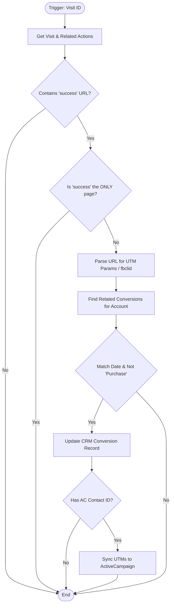

**Postman Documentation:** [Link to API Collection Placeholder]

---

## Overview
The `getVisits1` function is a marketing attribution and synchronization script within the Cordulus ecosystem. It is triggered by a "Visit" record (via automation when a web session is logged). Its primary role is to analyze a user's navigation history (Actions Performed), identify if a "Success" page was reached, extract UTM parameters for attribution, and then back-fill that data into both Zoho CRM "Conversions" records and the external ActiveCampaign marketing platform.

## Technical Contract
- **Input:** `Int visit_id`
- **Output:** None (Side-effect: Updates CRM records and ActiveCampaign Contact)
- **Primary Entities:** 
    - `Visits` (Zoho CRM)
    - `Actions_Performed` (Zoho CRM)
    - `Conversions` (Zoho CRM)
    - `Contacts` (Zoho CRM)
    - `ActiveCampaign` (External API)

## Dependency Map
This script orchestrates the following internal functions and external services:

| Function / Service | Purpose | Criticality |
| --- | --- | --- |
| Zoho CRM API | Data retrieval for Visits, Contacts, and Accounts; Updating Conversion records. | High |
| ActiveCampaign API | Synchronizing UTM attribution data to the marketing automation platform. | Medium |
| `activecampaign` Connection | OAuth connection for authenticated requests to ActiveCampaign. | High |

## Logic Flow

## Core Logic Sections

### 1. Qualification & Session Filtering
The script first retrieves all `Actions_Performed` for a visit. It specifically looks for a URL containing "success". 

> [!IMPORTANT]
> To prevent false positives from refreshed tabs or abandoned sessions, the script terminates if the "success" page is the only page recorded in the session (`isOnlySuccessPage`).

### 2. Marketing Attribution (UTM Parsing)
The script extracts attribution data from the `Accessed` URL:
- **UTM Mode:** If `utm` is present, it parses the query string into a Map. It includes specific normalization for Facebook/Meta sources.
- **FBCLID Mode:** If no UTMs are present but an `fbclid` exists, it defaults to `Source: Facebook` and `Traffic: Paid`.
- **Organic/Direct:** If no parameters are found, it defaults to `Source: Direct` and `Traffic: Organic`.

### 3. CRM Conversion Synchronization
The script looks for "Demo_Conversions" associated with the contact's Account. It matches the Visit to a Conversion record if they share the same creation date and the conversion is not a "Purchase Conversion". It then updates the Conversion record with the parsed UTM data and the "Conversion URL" (the page visited immediately before the success page).

### 4. ActiveCampaign Integration
If the contact is linked to ActiveCampaign (`ActiveCampaign_Contact_ID` is present), the script pushes the `utm_source`, `utm_medium`, and `utm_campaign` to specific custom fields using the `contact/sync` endpoint.

## Developer Notes

> [!WARNING]
> The ActiveCampaign field IDs (`47`, `48`, `49`) are hardcoded. If the ActiveCampaign schema changes or fields are deleted/recreated, this sync will fail or map to the wrong fields.

> [!CAUTION]
> The attribution logic assumes that the `Actions_Performed` records are returned in an order that allows identifying the page visited *immediately before* the success page within the loop.

- **Edge Case:** If a user visits multiple "success" pages in one visit, the `conversion_url` might be overwritten or incorrectly captured depending on the order of the related records.
- **Normalization:** Note the logic `if(utm_source = "fb" || ...)` uses a single `=` for assignment/comparison in some Deluge environments, but standard Deluge comparison should be `==`.

## Change Log
- **2026-03-19T18:59:02.750Z:** Initial creation of documentation via DeluluDocu.