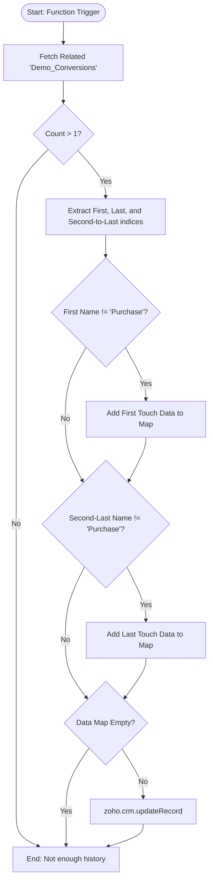

**Postman Documentation:** [Link to API Collection Placeholder]

---

## Overview
The `delugeManualUpdateFirstLastTouch` function is designed to attribute marketing or sales "touches" to a specific Purchase Conversion record. When a purchase occurs, this script analyzes the history of all conversions (likely demo requests or lead magnets) associated with the Account to identify which event was the very first interaction (First Touch) and which was the interaction immediately preceding the purchase (Last Touch). It calculates the time delta (in days) and updates the purchase record with these insights for better ROI reporting.

## Technical Contract
- **Input:** 
    - `account_id` (Int): The unique ID of the Account associated with the conversion.
    - `purchase_conversion_id` (Int): The unique ID of the specific "Purchase Conversion" record being updated.
    - `purchase_conversion_created_time` (Date): The timestamp when the purchase occurred.
- **Output:** Side effect: Updates the "Conversions" module record with attribution data.
- **Primary Entities:** 
    - `Accounts`
    - `Demo_Conversions` (Related List)
    - `Conversions` (Module)

## Dependency Map
This script orchestrates the following internal functions and external services:

| Function / Service | Purpose | Criticality |
| --- | --- | --- |
| Zoho CRM API | Used to retrieve related conversion records and update the target record. | High |

## Logic Flow

## Core Logic Sections

### 1. Retrieval and Record Sorting
The script fetches all related records from the `Demo_Conversions` list for the given account. Zoho Deluge returns these in an order where the newest is usually at index 0 and the oldest is at the final index (`size - 1`).

### 2. First Touch Attribution
The script identifies the oldest record (index `size - 1`). It validates that this record isn't already a "Purchase Conversion" (to avoid circular attribution). If valid, it extracts the ID, Name, Created Date, and calculates the `daysBetween` the first touch and the current purchase.

### 3. Last Touch (Second-to-Last) Attribution
The script identifies the second-to-last conversion record (index 1). Since the current purchase is often the "Last" record in the list (index 0), the interaction immediately before it provides the "Last Touch" context. Similar validation and duration calculations are performed.

### 4. Data Persistence
If either the First or Last touch data is valid, a `Map` is populated and sent to the `Conversions` module via an update call targeting the `purchase_conversion_id`.

## Developer Notes

> [!IMPORTANT]
> The script assumes that the record at index 0 is the current Purchase Conversion being processed. If the related list sorting order in the CRM changes, the logic for `last_conversion` (index 0) vs `second_last_conversion` (index 1) may result in incorrect attribution.

> [!WARNING]
> This function uses `.left(10)` on the `Created_Time` string. This assumes the standard Zoho ISO date format. If the date format is modified at the organization level, this substring logic might fail.

> [!CAUTION]
> The variable `org_id` is hardcoded as `"20087400261"` at the start of the script but is currently unused by the Zoho CRM API tasks. This should be cleaned up or utilized to ensure multi-DC compatibility if needed.

> [!TIP]
> This script is optimized to only perform an API update if there is actually data to change (`purchase_conversion_data.size() > 0`), which saves on API limits.

## Change Log
- **2026-03-19T16:04:13.074Z:** Initial creation of documentation via DeluluDocu.
- **2026-03-19T19:35:31.937Z:** Verified logic for first and second-to-last conversion attribution. Added caution regarding hardcoded Organization ID and updated Mermaid diagram for syntax compliance.