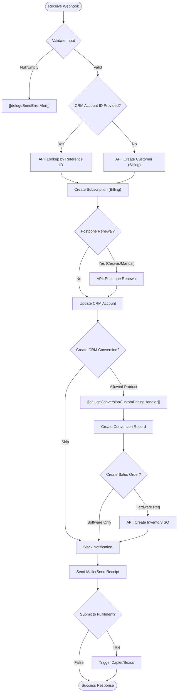

**Postman Documentation:** [Link to API Collection Placeholder]

---

## Overview
The `delugeSubscriptionHandler` serves as a central orchestration engine for processing new subscription requests, typically triggered by an external frontend or signup portal. Its primary role is to bridge Zoho Billing, Zoho CRM, and Zoho Inventory while ensuring all stakeholders are notified via Slack and Email. 

The script automates the entire lifecycle of a new subscription: from customer creation and plan activation to CRM record updates, sales order generation, and fulfillment triggering.

## Technical Contract
- **Input:** `String crmAPIRequest` (Expected as a JSON string containing a `body` object with customer, distributor, and product metadata).
- **Output:** `String` (A JSON-formatted string containing a `crmAPIResponse` with status codes 200 for success or 500 for failure).
- **Primary Entities:** 
    - Zoho Billing (Customers, Subscriptions)
    - Zoho CRM (Accounts, Conversions)
    - Zoho Inventory (Sales Orders)
    - Slack (Notifications)
    - MailerSend (Transactional Emails)

## Dependency Map
This script orchestrates the following internal functions and external services:

| Function / Service                       | Purpose                                                                                | Criticality |
| ---------------------------------------- | -------------------------------------------------------------------------------------- | ----------- |
| [[delugeSendErrorAlert]]                 | Dispatches error notifications to developers upon failure.                             | High        |
| [[delugeConversionCustomPricingHandler]] | Calculates custom line items and pricing for CRM Conversion records.                   | Medium      |
| Zoho Billing API                         | Manages recurring billing entities (Lookup via Reference ID or Creation).              | High        |
| Zoho CRM API                             | Updates Account data and creates Conversion records.                                   | High        |
| MailerSend API                           | Sends branded activation receipts to customers and distributors.                       | Medium      |
| Slack API                                | Provides real-time visibility into new sales for the team.                             | Low         |
| Zapier (Bezos Hook)                      | Triggers physical fulfillment for hardware products.                                   | Medium      |

## Logic Flow

## Core Logic Sections

### 1. Initialization and Validation
The script begins by extracting the `body` from the `crmAPIRequest`. It performs strict null checks. If the data is missing, it triggers `[[delugeSendErrorAlert]]` and halts immediately to prevent data corruption or partial processing.

### 2. Zoho Billing Integration (Step 1-4)
- **Customer Matching (Reference Lookup):** The script attempts to find an existing customer using the `zcrm_account_id` reference via the Zoho Billing reference endpoint. This is more reliable than name or email matching.
- **Customer Creation:** If no CRM Account ID is provided in the payload, the script proceeds to create a brand new customer profile in Zoho Billing using the provided company and contact details.
- **Subscription Creation:** It activates a subscription based on the `subscriptionPlanCode`.
- **Ceravis Special Logic:** If the distributor is "Ceravis AG", the script calculates a custom renewal date (always Jan 1st of the following billing year) and calls the `/postpone` endpoint.

### 3. CRM Data Synchronization (Step 5-6)
- **Account Update:** Synchronizes VAT numbers, distributor lookups, and shipping/billing addresses from the payload to the Zoho CRM Account module.
- **Purchase Conversions:** If the product belongs to the "Cordulus Farm/Road" families, it creates a record in the custom **Conversions** module. This includes line-item mapping via `[[delugeConversionCustomPricingHandler]]`.

### 4. Inventory and Fulfillment (Step 6-8)
- **Sales Orders:** For physical hardware (e.g., Cordulus Farm stations), the script calls a CRM Function (`getwarehousedetails`) to generate a Sales Order in Zoho Inventory.
- **MailerSend:** Dispatches an email using a predefined template (`351ndgwn3qgzqx8k`). It includes logic to CC specific distributor contacts based on a hardcoded map.
- **Bezos/Zapier:** If `submitToFulfilment` is true, the raw payload is forwarded to a Zapier webhook for logistics processing.

## Developer Notes

> [!TIP]
> **Improved Customer Matching:** The update implemented on 2026-03-27 switched from searching by email to searching by `zcrm_account_id`. This prevents duplicate customer creation when a CRM account already has a billing profile linked via a different email address.

> [!TIP]
> **Diagnostic Logging:** Added `info` statement for the Billing Customer response (`findBillingCustomerResp`) to help debug data mapping issues when the reference lookup returns unexpected results.

> [!WARNING]
> **Hardcoded Credentials:** The Sales Order generation section uses a hardcoded `zapikey` in the `invokeurl`. This should be migrated to a Connection or an Encrypted Variable for security.

> [!IMPORTANT]
> **Product Filtering:** CRM Conversion records are only created for specific products listed in the `allowedProducts` list. If adding a new product line to the business, this list MUST be updated here.

> [!CAUTION]
> **Ceravis Renewal Logic:** The postponement logic for Ceravis AG assumes a specific billing cycle. If their contract terms change, the month/year calculation in Step 4 will require adjustment.

## Change Log
- **2026-03-19T16:03:22.676Z:** Initial creation of documentation via DeluluDocu.
- **2026-03-27T11:41:12.956Z:** Refactored Zoho Billing customer lookup logic. Switched from email-based search to `zcrm_account_id` reference lookup via the Billing `/customers/reference/` endpoint to improve matching accuracy for existing CRM accounts. Removed redundant email search logic when `customerAccountId` is present.
- **2026-03-27T11:45:14.160Z:** Added diagnostic logging for the Zoho Billing customer reference lookup response to assist in troubleshooting intermittent API connectivity issues during the subscription flow.