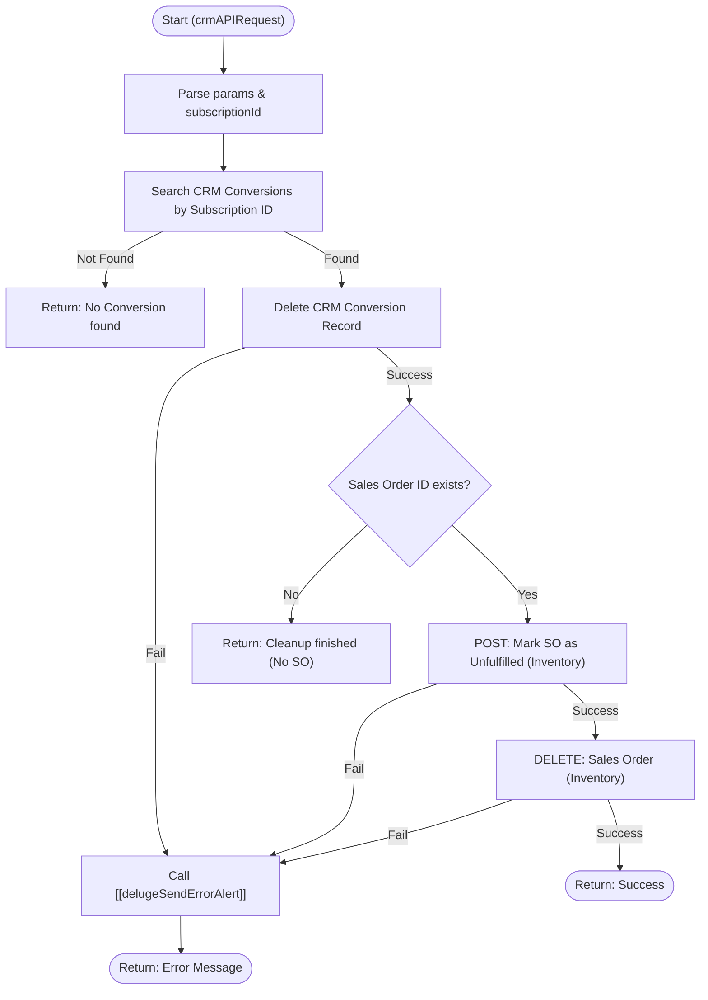

**Postman Documentation:** [Link to API Collection Placeholder]

---

## Overview
The `delugeSubscriptionReversalHandler` is a standalone utility designed to roll back transactions associated with a specific Subscription ID. It acts as a cleanup mechanism when a subscription is cancelled or reversed, ensuring data consistency across Zoho CRM and Zoho Inventory. Its primary role is to locate and delete "Purchase Conversion" records in the CRM and subsequently remove the linked Sales Order in Zoho Inventory.

## Technical Contract
- **Input:** `crmAPIRequest` (String) - Expected to contain a JSON object with a `params` map including `subscriptionId`.
- **Output:** `String` - A success message or a detailed error description.
- **Primary Entities:** 
    - **Zoho CRM:** Conversions Module
    - **Zoho Inventory:** Sales Orders

## Dependency Map
This script orchestrates the following internal functions and external services:

| Function / Service | Purpose | Criticality |
| --- | --- | --- |
| [[delugeSendErrorAlert]] | Handles error reporting by sending alerts when API calls fail or exceptions occur. | High |
| Zoho CRM API | Used to search for and delete Conversion records. | High |
| Zoho Inventory API | Used to transition Sales Order status to unfulfilled and perform the final deletion. | High |

## Logic Flow

## Core Logic Sections

### 1. Initialization and Lookup
The script extracts the `subscriptionId` from the incoming request. It then queries the Zoho CRM `Conversions` module. If no conversion record is found matching the ID, the script terminates early as there is nothing to reverse.

### 2. CRM Conversion Deletion
If a record is found, the script identifies the `Sales_Order_ID` for the next stage and proceeds to delete the Conversion record via the CRM V3 API. This requires a valid connection named `zohocrmconnection`.

### 3. Inventory Sales Order Reversal
If a `Sales_Order_ID` was linked to the conversion, the script performs a two-step deletion in Zoho Inventory:
1.  **Unfulfillment:** Sales Orders cannot be deleted if they are in certain active states. The script calls the `status/unfulfilled` endpoint.
2.  **Deletion:** Once unfulfilled, a `DELETE` request is sent to remove the Sales Order entirely from the organization `20087400261`.

## Developer Notes

> [!IMPORTANT]
> This script uses hardcoded Organization IDs (`20087400261`) and the `.eu` multi-node environment. If the client migrates to a different DC (e.g., .com), these URLs must be updated.

> [!WARNING]
> The script assumes that the `Sales_Order_ID` stored in the CRM Conversion record is the correct Internal ID for Zoho Inventory. If there is a mismatch between CRM and Inventory IDs, the Inventory deletion steps will fail.

> [!TIP]
> This function is "destructive" by design. It is recommended to ensure that the calling trigger has appropriate validation logic to prevent accidental deletions of active subscriptions.

## Change Log
- **2026-03-19T16:03:30.855Z:** Initial creation of documentation via DeluluDocu.