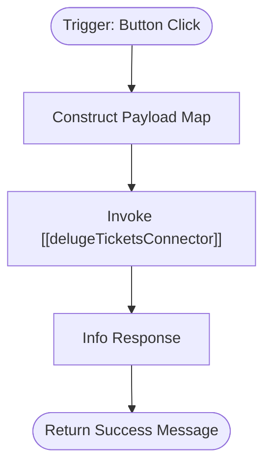

**Postman Documentation:** [Link to API Collection Placeholder]

---

## Overview
The `delugePopulaceInitiatePasswordReset` function serves as a trigger mechanism within the Cordulus ecosystem to initiate a password recovery workflow for a user. Typically invoked via a button on a record (likely within Zoho CRM or a custom portal), this script aggregates user identification and localization data and hands it off to a centralized ticket and authentication connector.

## Technical Contract
- **Input:** 
    - `String record_Id`: The unique identifier of the source record.
    - `String email`: The user's email address receiving the reset link.
    - `String language`: The preferred language for the reset communication.
    - `String platform`: The specific application platform the user is requesting access to.
- **Output:** `String` ("Password reset requested successfully")
- **Primary Entities:** 
    - User/Populace Records
    - Authentication Service (via Connector)

## Dependency Map
This script orchestrates the following internal functions and external services:

| Function / Service | Purpose | Criticality |
| --- | --- | --- |
| [[delugeTicketsConnector]] | Acts as the gateway to process the "initiatePasswordReset" action and communicate with the backend auth service. | High |

## Logic Flow
The script follows a linear execution path to transform button parameters into a structured request for the standalone connector.

## Core Logic Sections

### 1. Payload Construction
The script extracts the user-specific parameters (`email`, `language`, `platform`) and packages them into a Map object. This ensures the downstream connector receives a standardized data structure regardless of the calling context.

### 2. Service Orchestration
The script utilizes the `standalone` namespace to call `delugeTicketsConnector`. It passes the action string `"initiatePasswordReset"`, which tells the connector which specific backend logic to execute.

## Developer Notes

> [!NOTE]
> The `record_Id` parameter is accepted by the function signature but is currently not included in the payload sent to the `delugeTicketsConnector`. It likely exists for logging purposes or future traceability within the calling environment.

> [!WARNING]
> This function does not perform client-side validation on the `email` string. It assumes the email provided is valid and exists within the system. Validation is deferred to the [[delugeTicketsConnector]].

## Change Log
- **2026-03-19T18:52:07.698Z:** Initial creation of documentation via DeluluDocu.