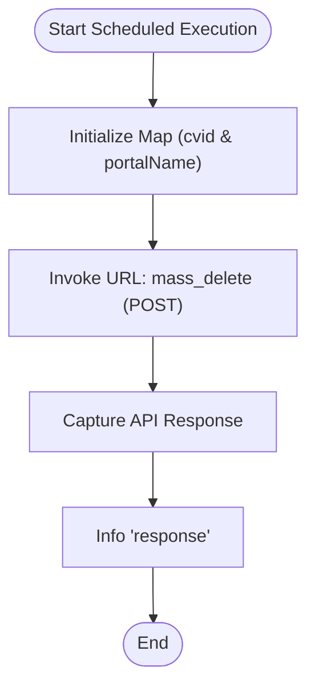

**Postman Documentation:** [Link to API Collection Placeholder]

---

## Overview
The `delugeDeleteVisitsOlderThan365Days` function is a maintenance utility, typically configured as a Scheduled Action, designed to automate data retention policies within the Zoho CRM "Visits" module. Its primary role is to trigger a mass deletion of records that fall into a specific Custom View (`cvid`), which is pre-filtered in the CRM UI to identify records older than 365 days.

## Technical Contract
- **Input:** None (Void function)
- **Output:** Side effect (Bulk deletion of CRM records); Logs API response to the Info console.
- **Primary Entities:** 
    - `Visits` (Zoho CRM Module)
    - `crm_oauth_visits` (System Connection)

## Dependency Map
This script orchestrates the following internal functions and external services:

| Function / Service | Purpose | Criticality |
| --- | --- | --- |
| Zoho CRM API v2.2 | Executes the `mass_delete` action on the Visits module. | High |
| Connection: `crm_oauth_visits` | Provides OAuth 2.0 authorization for the API call. | High |

## Logic Flow

## Core Logic Sections

### 1. Request Configuration
The script defines the target criteria by referencing a specific Custom View ID (`520877000303959500`). This shifts the logic of "what" to delete from the code to the CRM View filters, allowing for non-code updates to retention logic.

### 2. API Execution
The script utilizes the Zoho CRM v2.2 Mass Delete endpoint. This is an efficient way to handle large volumes of records without hitting statement limits associated with iterating through records in a standard Deluge loop.

## Developer Notes

> [!IMPORTANT]
> This script is entirely dependent on the existence of the Custom View ID `520877000303959500`. If this view is deleted or its ID changes in the CRM, the script will fail to identify records for deletion.

> [!CAUTION]
> The `mass_delete` action is permanent. Ensure the filters on the referenced Custom View in the "Visits" module are locked to prevent accidental deletion of recent data.

> [!TIP]
> The connection `crm_oauth_visits` must have the `ZohoCRM.modules.visits.DELETE` scope (or equivalent administrative scope) for the `invokeurl` to succeed.

## Change Log
- **2026-03-19T19:10:23.528Z:** Initial creation of documentation via DeluluDocu.