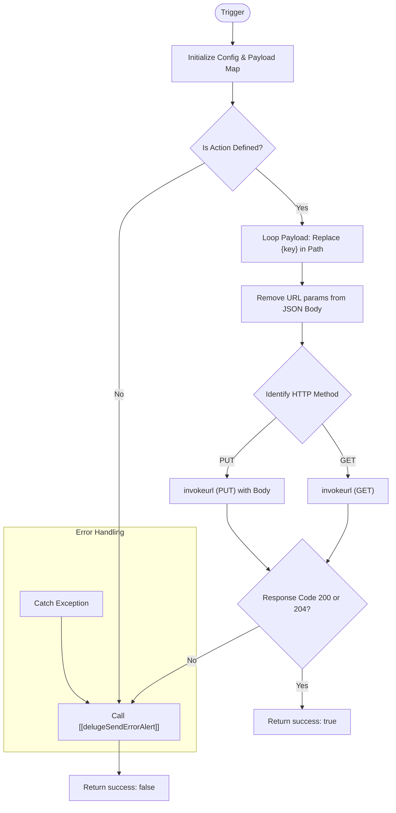

**Postman Documentation:** [Link to API Collection Placeholder]

---

## Overview
This function acts as a centralized middleware connector for interacting with the **Cordulus Daggers API** (`daggers.cordulus.com`). It abstracts the complexity of URL construction, placeholder replacement, and authentication. Its primary role is to synchronize or retrieve subscription data for specific workspaces within the Daggers ecosystem, ensuring consistent error handling and alerting across all integration points.

## Technical Contract
- **Input:** 
    - `action` (String): The operation to perform (e.g., `syncSubscriptions`, `getSubscriptions`).
    - `workspaceId` (String): The unique identifier for the Daggers workspace.
    - `subscriptionsPayload` (String): The JSON-formatted string containing subscription data (used primarily for PUT actions).
- **Output:** A Map containing:
    - `success` (Boolean): Indicates if the operation was successful.
    - `response` (Map): The detailed response from the `invokeurl` call.
    - `error_message` (String): Detailed error description if `success` is false.
- **Primary Entities:** 
    - **Daggers API Service**: External subscription management endpoint.
    - **Zoho Connections**: Uses a connection named `"daggers"` for OAuth/API Key management.

## Dependency Map
This script orchestrates the following internal functions and external services:

| Function / Service | Purpose | Criticality |
| --- | --- | --- |
| [[delugeSendErrorAlert]] | Centralized error logging and notification service. | High |
| **Daggers API** | External service for subscription management. | High |
| **Zoho Connection: "daggers"** | Provides authentication context for the API calls. | High |

## Logic Flow

## Core Logic Sections

### 1. Configuration & Action Mapping
The script maintains a local configuration map (`config`) that defines the HTTP Method (`m`) and the URL Path (`p`) for every supported action. This allows for easy extension if new Daggers endpoints are added.

### 2. Dynamic URL Interpolation
The script iterates through the input payload and searches the path for placeholders wrapped in braces (e.g., `{workspaceId}`). 
- It performs an `encodeUrl()` on the values for safety.
- **Crucially**, it removes the keys used in the URL from the payload map to ensure that path parameters are not redundant or incorrectly included in the JSON request body.

### 3. Execution & Connection
Requests are routed through `invokeurl` using the `"daggers"` connection. It explicitly handles `PUT` (for syncing/updating) and `GET` (for retrieving) methods with the `detailed: true` flag to capture specific response codes.

### 4. Standardized Response Handling
Success is strictly defined as HTTP 200 or 204. Any other status code, or a script execution exception, triggers a call to `[[delugeSendErrorAlert]]` to notify administrators and returns a structured error object.

## Developer Notes

> [!IMPORTANT]
> This script requires a Zoho Connection named `daggers` to be pre-configured in the environment. If the connection name changes or expires, all Daggers integrations will fail.

> [!TIP]
> The `subscriptionsPayload` input is treated as a string and converted to a JSON body for `PUT` requests. Ensure the calling script passes a valid JSON string to avoid API schema validation errors.

> [!CAUTION]
> The logic uses `path.toList(searchTarget)` and `parts.toText(val)` for string replacement. This is a Deluge-specific workaround for the lack of a global `replace` function for specific patterns; ensure `searchTarget` is unique within the path string.

## Change Log
- **2026-03-19T15:35:18.664Z:** Initial creation of documentation via DeluluDocu.