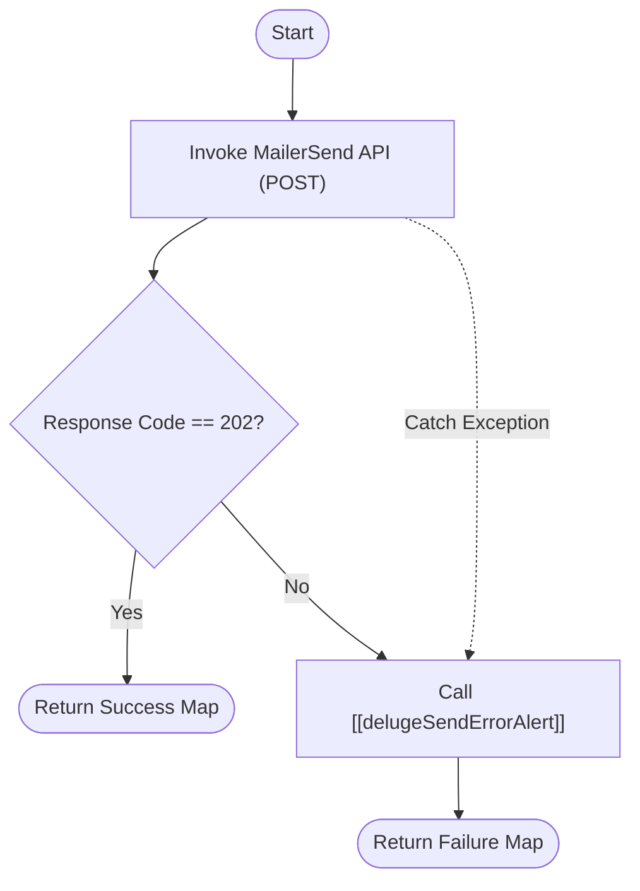

**Postman Documentation:** [Link to API Collection Placeholder]

---

## Overview
The `delugeMailersendConnector` function serves as a centralized gateway for sending transactional emails via the MailerSend external service. It abstracts the `invokeurl` complexities, handles the specific "202 Accepted" success state used by MailerSend, and ensures that any delivery failures are logged and alerted through the internal error handling framework.

## Technical Contract
- **Input:** `Map payload` - A structured map containing the email details (to, from, subject, content) formatted for the MailerSend API.
- **Output:** `Map` - A standardized response map: `{"success": boolean, "data/error_message": value}`.
- **Primary Entities:** MailerSend API, Zoho Connections.

## Dependency Map
This script orchestrates the following internal functions and external services:

| Function / Service | Purpose | Criticality |
| --- | --- | --- |
| [[delugeSendErrorAlert]] | Reports API failures or runtime exceptions to the development team. | High |
| MailerSend API | External SMTP/API provider responsible for email delivery. | High |

## Logic Flow

## Core Logic Sections

### 1. API Invocation
The script utilizes the `invokeurl` task to send a POST request to `https://api.mailersend.com/v1/email`. It relies on a pre-configured Zoho Connection named `"mailersend"` to handle authentication (likely via Bearer Token).

### 2. Validation & Response Handling
Unlike many APIs that return 200 for success, MailerSend returns a **202 (Accepted)**. The script explicitly checks for this code. If the code matches, it passes the full API response back to the caller.

### 3. Error Redundancy
The logic is wrapped in a `try...catch` block. Both unexpected exceptions and non-202 API responses trigger an internal alert via `[[delugeSendErrorAlert]]`, providing the payload and the error details for debugging.

## Developer Notes

> [!TIP]
> This function expects the `payload` map to be pre-formatted according to MailerSend's requirements. It does not perform validation on the internal structure of the email (e.g., checking for valid email addresses).

> [!IMPORTANT]
> Ensure the Zoho Connection `"mailersend"` is active and has the necessary permissions. If the connection is deleted or renamed, this function will fail with an authentication error.

> [!CAUTION]
> The `payload.toString()` conversion inside the `invokeurl` parameters is suitable for basic maps, but ensure the caller passes a map that translates correctly to JSON.

## Change Log
- **2026-03-19T15:34:35.055Z:** Initial creation of documentation via DeluluDocu.