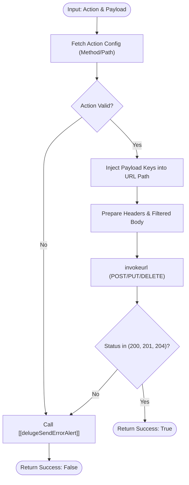

**Postman Documentation:** [Link to API Collection Placeholder]

---

## Overview
The `delugePopulaceConnector` serves as the centralized middleware for interacting with the Cordulus Populace API. It abstracts the complexities of endpoint construction, HTTP method selection, and error handling for various administrative tasks including User management, Workspace configuration, and Distributor assignments. 

This script is triggered by other standalone scripts or automation workflows that need to sync Zoho data with the Populace backend. It uses a predefined configuration map to translate logical "actions" into specific API routes and methods.

## Technical Contract
- **Input:** 
    - `String action`: The logical operation name (e.g., `createUser`, `addMembership`).
    - `Map payload`: A key-value map containing both the body data and any URL path parameters (e.g., `userId`).
- **Output:** A Map (returned as string/map literal) containing `{"success": true/false, "data": "response text", "error_message": "details"}`.
- **Primary Entities:** 
    - Populace API Service
    - Zoho Connection: `populace`
    - Users, Workspaces, Distributors, Memberships

## Dependency Map
This script orchestrates the following internal functions and external services:

| Function / Service | Purpose | Criticality |
| --- | --- | --- |
| [[delugeSendErrorAlert]] | Logs failures and notifies administrators of API communication errors. | High |
| Populace API | External service managing user access and workspace hierarchy. | Mission Critical |

## Logic Flow

## Core Logic Sections

### 1. Action Configuration Map
The script maintains an internal registry of supported actions. Each entry defines the HTTP verb and the URL path template. Path templates use curly braces (e.g., `{userId}`) which are dynamically replaced by values in the input payload. It supports:
- **Users**: Create, Update, Delete.
- **Workspaces**: Create, Update, Delete.
- **Distributors**: Create, Update, Add Workspace, Add/Remove User.
- **Memberships**: Add/Delete (Linkage between Users and Workspaces).

### 2. Dynamic URL Interpolation
The script iterates through the `payload`. If a key in the payload matches a `{placeholder}` in the URL path, the value is URL-encoded, injected into the string, and **removed** from the payload map. This ensures that path parameters are not redundantly sent in the JSON request body.

### 3. Execution & Connection Management
Requests are routed through the Zoho Connection named `populace`. The script explicitly handles `POST`, `PUT`, and `DELETE` methods, setting `detailed: true` to capture response codes for validation.

### 4. Error Catching & Reporting
A global `try...catch` block handles execution runtime errors. In both runtime failures and HTTP error responses (outside the 200-range), the script invokes `[[delugeSendErrorAlert]]` with the specific error context and payload for debugging.

## Developer Notes

> [!IMPORTANT]
> This script modifies the `payload` map in-place during the URL construction phase. If a key is used as a path parameter (e.g., `{userId}`), it will be removed and will **not** be present in the final JSON body sent to the API.

> [!TIP]
> When adding new endpoints to the `config` map, ensure the parameter names in the URL path (e.g., `{workspaceId}`) exactly match the keys being passed in the payload from the calling script.

> [!CAUTION]
> If an API endpoint requires the same ID to be present in both the URL path and the JSON body, this script's interpolation logic will fail to include it in the body. In such cases, the script logic would need to be modified to clone the key before removal.

> [!NOTE]
> The script currently returns a Map literal while the signature is defined as `string`. While Deluge handles this loosely, if you experience type-mismatch errors in calling scripts, ensure you handle the response as a Map.

## Change Log
- **2026-03-19T15:32:20.794Z:** Initial creation of documentation via DeluluDocu. 
- **2024-10-12:** Added Distributor-related endpoints (`addWorkspaceToDistributor`, `addUserToDistributor`).
- **2026-03-19T17:36:25.111Z:** Documentation audit and verification. Script code remains unchanged; verified logic for endpoint handling and connection parameters. No logic changes detected in this revision.
- **2026-03-19T18:31:35.916Z:** Documentation update. Compared script versions; confirmed no functional changes in the logic or endpoint configuration. Logic remains stable.
- **2026-03-27T21:03:10.201Z:** Documentation sync and logic validation. Verified the dynamic URL interpolation logic and confirmed the removal of path parameters from the body payload. Identified potential edge case where an ID might be needed in both path and body. No logic changes were made to the script code in this revision.