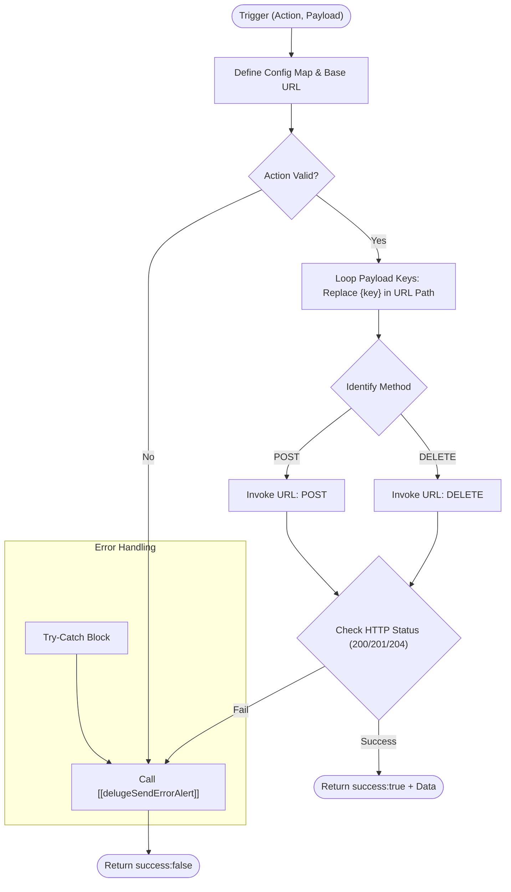

**Postman Documentation:** [Link to API Collection Placeholder]

---

## Overview
The `delugeSchlechtwetterConnector` is a centralized utility function designed to facilitate communication between Zoho and the Cordulus Schlechtwetter (Bad Weather) API. It handles the abstraction of HTTP methods, URL path parameter substitution, and standardized error reporting. 

This script serves as the primary gateway for syncing and deleting workspace data within the Schlechtwetter microservice, ensuring that all outgoing requests are formatted correctly and authenticated via a dedicated Zoho Connection.

## Technical Contract
- **Input:** 
    - `String action`: The identifier for the API operation (e.g., `syncSchlechtwetter`, `deleteSchlechtwetter`).
    - `String payload`: A stringified Map containing the data required for the request, including URL path parameters (like `workspaceId`).
- **Output:** A Map containing:
    - `success`: (Boolean) Indicates if the API call was successful (HTTP 200, 201, or 204).
    - `data`: (String) The response text from the API (on success).
    - `error_message`: (String) Descriptive error details (on failure).
- **Primary Entities:** 
    - External: `Cordulus Schlechtwetter API`
    - Zoho: `Connection: "schlechtwetter"`

## Dependency Map
This script orchestrates the following internal functions and external services:

| Function / Service | Purpose | Criticality |
| --- | --- | --- |
| [[delugeSendErrorAlert]] | Logs failures and notifies administrators of API or runtime errors. | Medium |
| `Connection: "schlechtwetter"` | Provides the necessary authentication/headers for the external API. | High |

## Logic Flow

## Core Logic Sections

### 1. Configuration & Endpoint Mapping
The script initializes a `config` Map that maps logical action names to their respective HTTP methods and path structures. This allows for easy extension if more endpoints are added to the Schlechtwetter service.

### 2. Dynamic URL Construction
The function iterates through the keys provided in the `payload`. If a key matches a placeholder in the path (e.g., `{workspaceId}`), it encodes the value and injects it into the URL. To prevent data redundancy, keys used in the URL path are removed from the `payload` map before it is potentially used as a request body.

### 3. Execution & Response Validation
The script supports `POST` and `DELETE` methods. It uses a specific Zoho Connection (`schlechtwetter`) to handle authentication. Responses are validated against a list of success codes (`200`, `201`, `204`).

### 4. Error Catching & Notification
Every failure—whether it's an invalid action, a non-success HTTP code, or a script exception—is routed through `[[delugeSendErrorAlert]]` to ensure visibility for the development team.

## Developer Notes

> [!CAUTION]
> **Payload Type Handling:** The function signature defines `payload` as a `String`, but the logic performs Map-specific operations like `.keys()` and `.remove()`. Ensure the calling script passes a Map variable, as Zoho Deluge often allows this type-flexibility, but passing a literal string will cause a runtime crash.

> [!TIP]
> **URL Encoding:** The script automatically uses `.encodeUrl()` on path parameters. Do not pre-encode values in the calling script to avoid double-encoding issues.

> [!IMPORTANT]
> **Connection Dependency:** This script will fail if the Zoho Connection named `schlechtwetter` is deleted or if its scopes expire.

## Change Log
- **2026-03-19T17:42:19.478Z:** Initial creation of documentation via DeluluDocu.