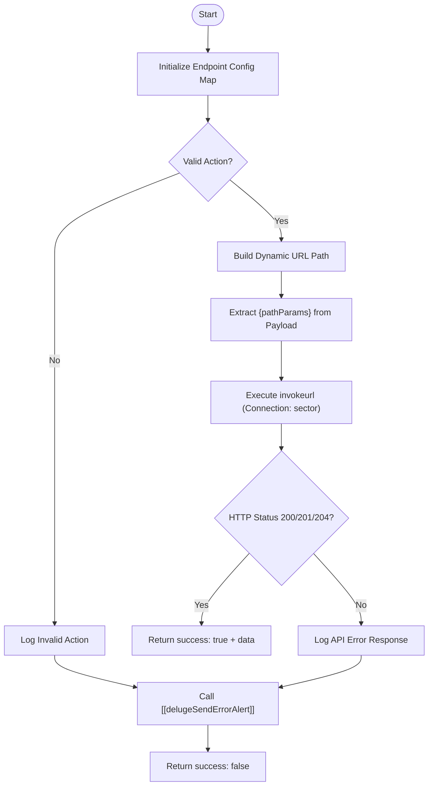

**Postman Documentation:** [Link to API Collection Placeholder]

---

## Overview
The `delugeSectorWeatherConnector` acts as a centralized middleware function for interacting with the Cordulus Sector API (`sector.cordulus.com`). It abstracts the complexity of HTTP methods, URL construction, and error handling for Weather Series and Workspace Series Subscriptions. This script is designed to be called by other business logic scripts that need to Create, Update, or Delete weather-related data in the Cordulus ecosystem.

## Technical Contract
- **Input:** 
    - `action` (String): The technical key representing the API operation (e.g., "createSeries", "updateWorkspaceSeriesSubscription").
    - `payload` (Map): The data to be sent in the request body or used for URL path replacement.
- **Output:** A Map containing:
    - `success` (Boolean): Indicates if the operation completed within the 200-level status code range.
    - `data` (String/Map): The response body from the API on success.
    - `error_message` (String): A detailed error description on failure.
- **Primary Entities:** 
    - Cordulus Sector API
    - Zoho Connection: `sector`

## Dependency Map
This script orchestrates the following internal functions and external services:

| Function / Service | Purpose | Criticality |
| --- | --- | --- |
| [[delugeSendErrorAlert]] | Logs failures and sends notifications to administrators. | High |
| Cordulus Sector API | The external endpoint for weather series management. | Critical |
| Zoho Connection: `sector` | Provides OAuth2/API Key authentication for the request. | Critical |

## Logic Flow

## Core Logic Sections

### 1. Endpoint Configuration Mapping
The script maintains an internal lookup table (`config`) that maps friendly action names to specific HTTP methods (`m`) and URL paths (`p`). This allows the developer to call `updateSeries` without needing to remember the REST verb or the exact endpoint structure.

### 2. Dynamic Path Parameter Injection
The script iterates through the `payload` keys. If a key matches a placeholder in the URL path (e.g., `{seriesId}`), it:
1.  Encodes the value for URL safety.
2.  Injects the value into the path.
3.  **Removes** the key from the payload map to ensure the ID is not redundant/duplicate when the remaining payload is sent as the JSON body.

### 3. Connection-Based Execution
The script utilizes the Zoho `invokeurl` task with a pre-configured connection named `sector`. It supports `POST`, `PUT`, and `DELETE` methods. Note that `DELETE` requests do not send a JSON body in this implementation.

### 4. Standardized Error Handling
The script wraps the entire operation in a `try-catch` block. Any failure (invalid action, API error, or runtime exception) triggers the `[[delugeSendErrorAlert]]` function to ensure visibility for the operations team.

## Developer Notes

> [!IMPORTANT]
> This script requires a Zoho Connection named **`sector`** to be configured in the environment. If the connection is missing or the scopes are incorrect, all API calls will fail.

> [!TIP]
> When calling this function for an `update` or `delete` action, ensure the `payload` Map contains the relevant ID key (like `seriesId` or `seriesSubId`) exactly as defined in the `config` map placeholders.

> [!CAUTION]
> The `DELETE` implementation in this script currently does not pass a request body. If the Sector API is updated to require body parameters for a DELETE request, Step 3 of the logic will need modification.

## Change Log
- **2026-03-19T18:19:37.945Z:** Initial creation of documentation via DeluluDocu. 
- **2026-03-19T18:19:37.945Z:** Implemented dynamic path replacement and support for Series and Subscription endpoints.