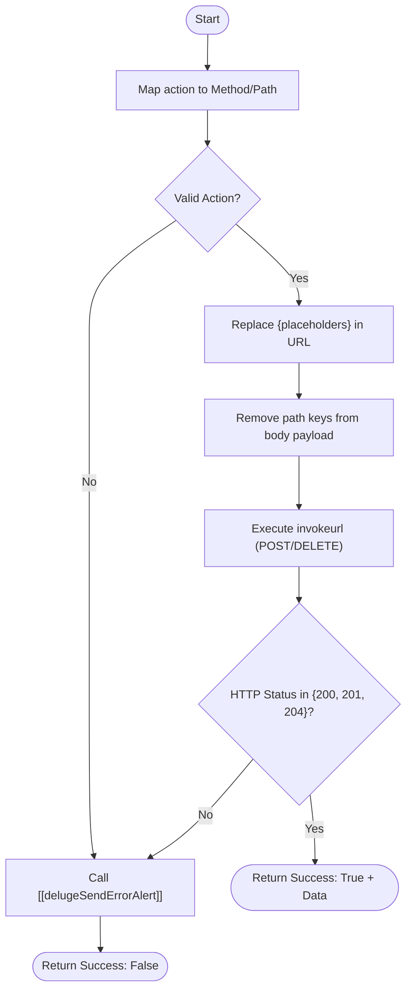

**Postman Documentation:** [Link to API Collection Placeholder]

---

## Overview
The `delugeTicketsConnector` is a centralized utility function designed to interface with the Cordulus Tickets API. It acts as a wrapper for various administrative and user-level operations, such as managing API keys, user credentials, and password resets. By abstracting the endpoint logic and URL construction, it provides a consistent interface for other Zoho Deluge scripts to interact with the external Tickets service without needing to manage authentication headers or specific URL paths manually.

## Technical Contract
- **Input:** 
    - `action` (String): The identifier for the operation to perform (e.g., `createApiKey`, `initiatePasswordReset`).
    - `payload` (Map): A map containing both the dynamic path parameters (like `userId`) and the data to be sent in the request body.
- **Output:** A Map containing `success` (Boolean) and either `data` (String response) or `error_message` (String).
- **Primary Entities:** 
    - External: Cordulus Tickets API (`https://tickets.cordulus.com`)
    - Zoho: Deluge Connection (`tickets`)

## Dependency Map
This script orchestrates the following internal functions and external services:

| Function / Service | Purpose | Criticality |
| --- | --- | --- |
| [[delugeSendErrorAlert]] | Logs errors and notifies administrators if an API call fails or an exception occurs. | Medium |
| External: Tickets API | The target service for all requests. | High |
| Zoho Connection: `tickets` | Provides OAuth2 or API Key authentication for the `invokeurl` calls. | High |

## Logic Flow

## Core Logic Sections

### 1. Configuration Mapping
The script maintains a local configuration map (`config`) that associates a friendly action name with an HTTP method (`m`) and a URI path (`p`). This allows for easy maintenance of API endpoints in one location.

### 2. Dynamic Path Parameter Injection
The script iterates through the `payload` map. If a key in the map (e.g., `userId`) matches a placeholder in the URL (e.g., `{userId}`), the script:
1. Encodes the value for URL safety.
2. Performs a find-and-replace in the URL string.
3. **Removes** the key from the payload map to ensure that path parameters are not redundantly sent in the JSON request body.

### 3. Execution & Response Handling
The script supports `POST` and `DELETE` methods via Zoho's `invokeurl`. It utilizes a specific connection named `tickets`. Responses are validated against a list of success codes (200, 201, 204). Any other status code triggers the error handling logic.

## Developer Notes

> [!IMPORTANT]
> This script relies on a Zoho Connection named `tickets`. If the connection is renamed or the credentials expire, all ticket-related operations will fail across the ecosystem.

> [!NOTE]
> The `initiatePasswordReset` action uses a fully qualified URL, bypassing the standard `baseUrl`. The logic includes a check (`path.startsWith("http")`) specifically to handle these variations in API architecture.

> [!CAUTION]
> Because path parameters are removed from the `payload` map during the URL building phase, any script calling this connector should be aware that the original payload map passed by reference may be modified.

## Change Log
- **2026-03-19T15:32:30.152Z:** Initial creation of documentation via DeluluDocu.