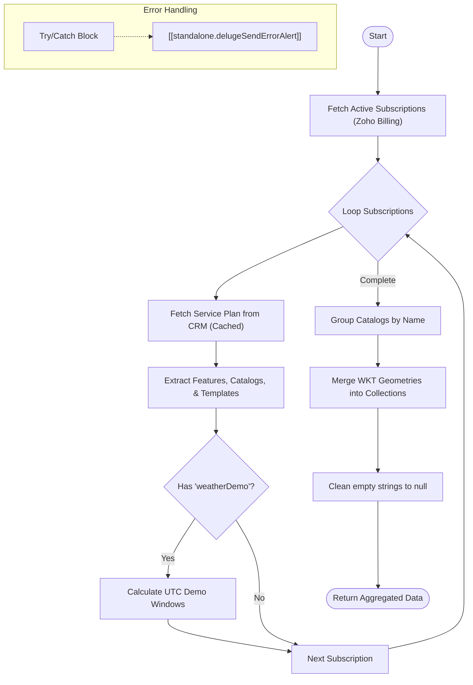

**Postman Documentation:** [Link to API Collection Placeholder]

---

## Overview
The `delugeFeatureAggregator` function acts as a centralized engine for determining a customer's total entitled feature set within the Cordulus ecosystem. It identifies all active subscriptions via Zoho Billing, retrieves corresponding metadata from the **Service Plans** module in Zoho CRM, and aggregates features, localization settings, and geospatial (WKT) catalog data. 

This is a critical function for provisioning access in the product, as it merges multiple subscription geometries and calculates trial/demo windows based on the earliest subscription creation time.

## Technical Contract
- **Input:** 
    - `String orgId`: The Zoho Billing Organization ID.
    - `String customerId`: The unique identifier for the customer in Zoho Billing.
    - `String country`: The ISO country code used for localization/template mapping.
- **Output:** 
    - `Map`: A JSON object containing `success` (boolean), `features` (List), `daggersPayloadList` (List of merged geometries), `demo_start`/`demo_end` (ISO Timestamps), `category` (String), and `language` (String).
- **Primary Entities:** 
    - **Zoho Billing**: Subscriptions API.
    - **Zoho CRM**: Service_Plans module (custom module), Template_Mappings (subform), Daggers_Catalogs_Mappings (subform).

## Dependency Map
This script orchestrates the following internal functions and external services:

| Function / Service       | Purpose                                                                    | Criticality |
| ------------------------ | -------------------------------------------------------------------------- | ----------- |
| Zoho Billing API         | Fetches active subscriptions for the specified customer.                   | High        |
| Zoho CRM (Service_Plans) | Provides the "truth" for features and geometries linked to a billing plan. | High        |
| [[delugeSendErrorAlert]] | Handles error logging and notifications in case of script failure.         | Medium      |

## Logic Flow

## Core Logic Sections

### 1. Subscription & CRM Enrichment
The script first queries Zoho Billing for all active subscriptions. For every subscription found, it performs a lookup in the CRM **Service Plans** module using the `plan_code`. To optimize performance, it uses `servicePlanCache` (a Map) to avoid redundant CRM API calls if the customer has multiple subscriptions of the same plan.

### 2. Feature & Localization Aggregation
It compiles a unique list of features (e.g., "weatherDemo", "forecastAccess"). It also iterates through the `Template_Mappings` subform; if the provided `country` matches a mapping, it sets the `language`. If no match is found, it defaults to English ("en").

### 3. Geospatial (WKT) Merging
This is the most complex section of the script. If a customer has multiple subscriptions providing data for the same catalog (e.g., "Danish_Field_Data"), the script:
1.  Identifies all records for that catalog.
2.  Prioritizes records containing `geometry` data.
3.  If multiple geometries exist, it extracts the WKT strings and merges them into a single `GEOMETRYCOLLECTION (...)`.
4.  Ensures that duplicate polygons are handled and trailing commas are cleaned.

### 4. Demo Window Calculation
If the `weatherDemo` feature is present, the script calculates the start and end dates. It converts the subscription's `created_time` (local timezone) into UTC for the `demo_start` and aligns the `demo_end` time to match the exact time of day on the expiration date.

## Developer Notes

> [!IMPORTANT]
> The script uses a specific hardcoded timezone (`Europe/Copenhagen`) for the initial conversion of Zoho Billing timestamps. If customers are provisioned in different timezones, verify if UTC offsets are being handled correctly by the Billing API.

> [!TIP]
> The geometry merging logic currently supports `POLYGON` and `GEOMETRYCOLLECTION` prefixes. If a new WKT type (like `MULTIPOLYGON`) is introduced in the Service Plans module, the string manipulation logic in Section 4 may need to be updated to support the new prefix.

> [!CAUTION]
> The `language` variable is initialized inside the loop but its scope is utilized in the final return. If a customer has no valid `Service_Plans` mapping, the language variable might be null. Ensure default values are robust.

## Change Log
- **2026-03-19T15:32:09.586Z:** Initial creation of documentation via DeluluDocu. Added logic for geometry collection merging and service plan caching.