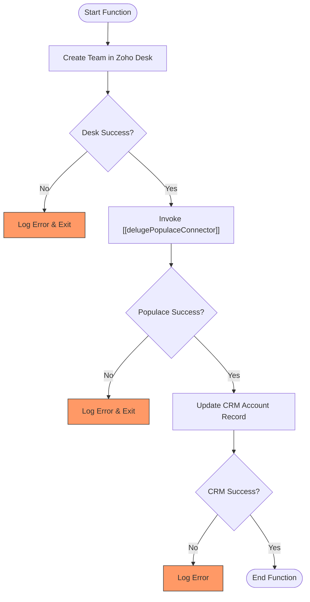

**Postman Documentation:** [Link to API Collection Placeholder]

---

## Overview
This function automates the provisioning process for a new Distributor. It orchestrates a three-step workflow: creating a dedicated Support Team in **Zoho Desk**, registering the distributor in the external **Populace** platform, and finally updating the source **Zoho CRM** Account with the resulting unique identifiers (`teamId` and `distributorId`).

## Technical Contract
- **Input:** 
    - `accountId` (Int): The unique ID of the Account in Zoho CRM.
    - `country` (String): The country associated with the distributor.
    - `accountName` (String): The name of the distributor/account.
    - `departmentId` (String): The ID of the Zoho Desk department where the team should be created.
- **Output:** `void` (The function performs side effects across three systems).
- **Primary Entities:** 
    - **Zoho Desk:** Team Management.
    - **Populace:** External Distributor Database.
    - **Zoho CRM:** Account records.

## Dependency Map
This script orchestrates the following internal functions and external services:

| Function / Service | Purpose | Criticality |
| --- | --- | --- |
| Zoho Desk API | Used to create a new team for the distributor. | High |
| [[delugePopulaceConnector]] | Handles the API communication with the Populace platform. | High |
| Zoho CRM API | Updates the source record with metadata from Desk and Populace. | Medium |

## Logic Flow

## Core Logic Sections

### 1. Zoho Desk Team Creation
The script first interacts with the Zoho Desk API (EU DC) to create a team named after the `accountName`. This uses the `zohodesk` connection. It validates a `200` response code before proceeding.

### 2. Populace Distributor Synchronization
Using the `standalone.delugePopulaceConnector`, the script sends the distributor's name, country, and CRM ID. This step is critical as it links the internal Zoho ecosystem with the external Populace platform.

### 3. CRM Record Enrichment
Once both external IDs (`teamId` from Desk and `distributorId` from Populace) are acquired, the script performs a `zoho.crm.updateRecord` on the Accounts module. This ensures the CRM remains the "Source of Truth" for all system IDs.

## Developer Notes

> [!CAUTION]
> The Zoho Desk API endpoint is hardcoded to `https://desk.zoho.eu`. If the organization migrates data centers (e.g., to .com), this URL must be updated.

> [!IMPORTANT]
> This script does not include a rollback mechanism. If the Desk team is created but the Populace creation fails, the Desk team will remain orphaned without its ID being recorded in CRM.

> [!TIP]
> Ensure the `zohodesk` connection has the `Desk.settings.CREATE` scope (or similar) authorized for the API call to succeed.

## Change Log
- **2026-03-19T18:52:24.758Z:** Initial creation of documentation via DeluluDocu.