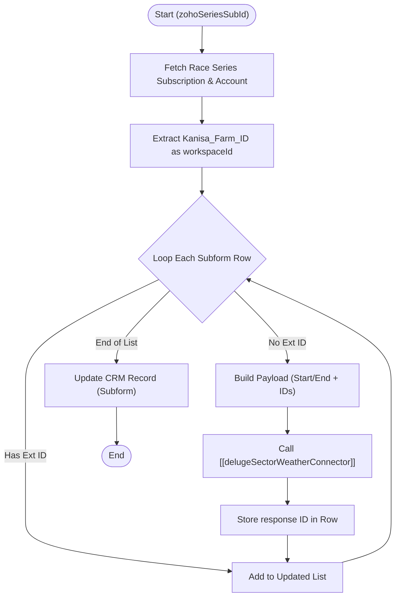

**Postman Documentation:** [Link to API Collection Placeholder]

---

## Overview
This function orchestrates the synchronization of series subscription data from Zoho CRM to the SectorWeather platform. It is triggered when a `Race_Series_Subscriptions` record needs to be provisioned. The script iterates through a subform of series, identifies items not yet synced, and utilizes a standalone connector to create the subscriptions externally, finally updating Zoho CRM with the returned external IDs.

## Technical Contract
- **Input:** `Int zohoSeriesSubId` (The unique ID of the Race Series Subscription record)
- **Output:** void (Side effect: Updates Zoho CRM subform rows with external IDs)
- **Primary Entities:** 
    - `Race_Series_Subscriptions` (CRM Module)
    - `Accounts` (CRM Module - for Workspace ID)
    - `Related_Race_Series` (Subform)

## Dependency Map
This script orchestrates the following internal functions and external services:

| Function / Service | Purpose | Criticality |
| --- | --- | --- |
| [[delugeSectorWeatherConnector]] | Standalone connector that executes the API request to the SectorWeather platform. | High |
| `zoho.crm.getRecordById` | Fetches the parent subscription and account details. | High |
| `zoho.crm.updateRecord` | Updates the CRM record with the external `SectorWeather_Series_Sub_ID`. | High |

## Logic Flow

## Core Logic Sections

### 1. Data Context Initialization
The script retrieves the `Race_Series_Subscriptions` record and navigates to the associated `Account` to retrieve the `Kanisa_Farm_ID`. This ID is mapped to the `workspaceId` required by the external API.

### 2. Delta Processing (Subform Loop)
The function iterates through the `Related_Race_Series` subform. It implements a "delta" logic where it only processes rows where `SectorWeather_Series_Sub_ID` is null. This prevents redundant API calls for items already successfully provisioned.

### 3. Time Adjustment & Formatting
Subscription start and end times are adjusted during payload construction:
- **Start:** Adds 1 hour to the CRM time.
- **End:** Adds 25 hours to the CRM time.
Both are formatted to ISO 8601 string format in the UTC timezone (`yyyy-MM-dd'T'HH:mm:ss'Z'`).

### 4. Integration & Persistence
For each qualifying row, the `[[delugeSectorWeatherConnector]]` is invoked with the `createWorkspaceSeriesSubscription` action. The resulting ID is mapped back to the subform row, and once the loop completes, the entire subform is pushed back to the CRM in a single `updateRecord` call.

## Developer Notes

> [!CAUTION]
> **API within Loops:** This script performs an external API call inside a `for each` loop. If a subscription contains a very large number of series (e.g., > 20), the script may approach Deluge execution time limits or API rate limits.

> [!IMPORTANT]
> **Data Types:** The `Kanisa_Farm_ID` and `SectorWeather_Series_ID` are explicitly cast using `.toLong()`. Ensure these fields in CRM contain numeric values to avoid runtime casting errors.

> [!TIP]
> The time adjustment logic (`addHour(1)` and `addHour(25)`) appears to be a business logic requirement to handle specific subscription windowing or timezone offsets. Ensure this aligns with the SectorWeather API's expectation for subscription durations.

## Change Log
- **2026-03-19T18:19:54.328Z:** Initial creation of documentation via DeluluDocu.