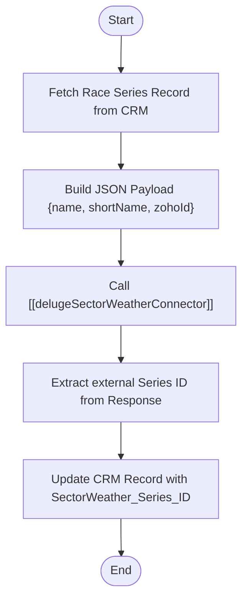

**Postman Documentation:** [Link to API Collection Placeholder]

---

## Overview
The `delugeTriggerCreateSectorWeatherSeries` function is responsible for synchronizing a "Race Series" from Zoho CRM to the SectorWeather external workspace. It acts as an orchestrator that retrieves record details, triggers an external creation via a standalone connector, and stores the resulting external ID back into the CRM to maintain a link between the two systems.

## Technical Contract
- **Input:** `Int zohoSeriesId` (The unique ID of the Race Series record in Zoho CRM).
- **Output:** `void` (Side effects: Updates a Zoho CRM record).
- **Primary Entities:** 
    - `Race_Series` (Zoho CRM Module)
    - SectorWeather Workspace (External Service)

## Dependency Map
This script orchestrates the following internal functions and external services:

| Function / Service | Purpose | Criticality |
| --- | --- | --- |
| [[delugeSectorWeatherConnector]] | Handles the actual API communication with the SectorWeather workspace. | High |
| `zoho.crm.getRecordById` | Native Zoho CRM method to fetch record data. | High |
| `zoho.crm.updateRecord` | Native Zoho CRM method to save the external ID. | High |

## Logic Flow

## Core Logic Sections

### 1. Data Retrieval and Initialization
The script initializes the process by defining the `createSeries` action and fetching the specific `Race_Series` record using the provided `zohoSeriesId`. It specifically extracts the `Name` and `Race_Series_Short_Name` fields required by the external API.

### 2. Integration Orchestration
The script uses a standardized payload structure to pass the local ID and naming conventions to the [[delugeSectorWeatherConnector]]. This abstraction ensures that the logic for API headers and authentication is handled separately from the business logic.

### 3. CRM Update (Synchronization)
Once the external service returns a successful response, the script parses the `id` from the response body. It then performs an `updateRecord` operation on the original CRM record, populating the `SectorWeather_Series_ID` field to ensure data integrity across platforms.

## Developer Notes

> [!WARNING]
> The script currently lacks error handling for the API response. If the `standalone.delugeSectorWeatherConnector` fails or returns an error object without a `data.id` path, the script may throw a runtime exception during the CRM update phase.

> [!TIP]
> This function is designed to be triggered via a Zoho CRM Workflow or Blueprint button when a user is ready to "push" a series to the weather platform.

## Change Log
- **2026-03-19T18:19:45.212Z:** Initial creation of documentation via DeluluDocu.