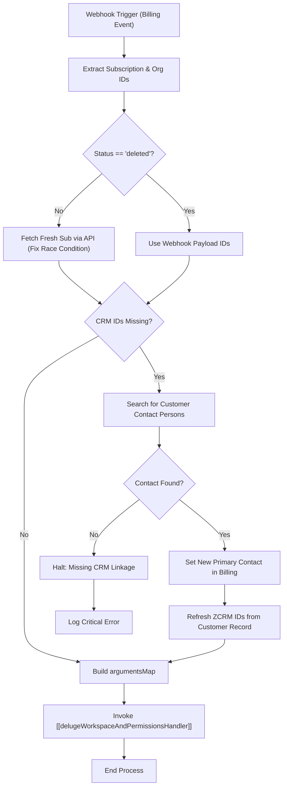

**Postman Documentation:** [Link to API Collection Placeholder]

---

## Overview
This script acts as a webhook handler triggered by Zoho Billing subscription events (creation, updates, deletions). Its primary purpose is to ensure that the subscription data is correctly synchronized with Zoho CRM by verifying the existence of `zcrm_contact_id` and `zcrm_account_id`. It includes logic to recover missing CRM linkages by programmatically setting a primary contact if the default one is unmapped. Once the data integrity is verified, it triggers a downstream orchestrator function in Zoho CRM to manage workspaces and user permissions.

## Technical Contract
- **Input:** 
    - `subscriptions` (Map): The subscription object from the Billing webhook.
    - `organization` (Map): The organization details from the Billing webhook.
- **Output:** Execution of side effects (CRM Function call or Billing Contact updates). No specific return value is returned to the webhook caller beyond standard info logs.
- **Primary Entities:** 
    - Zoho Billing (Subscriptions, Customers, Contact Persons)
    - Zoho CRM (Accounts, Contacts)

## Dependency Map
This script orchestrates the following internal functions and external services:

| Function / Service | Purpose | Criticality |
| --- | --- | --- |
| [[delugeWorkspaceAndPermissionsHandler]] | CRM-side orchestrator that processes workspace and permission logic based on the subscription status. | High |
| Zoho Billing API | Used to retrieve fresh subscription/customer data and update primary contact persons. | High |
| Zoho CRM API | Referenced via the orchestrator call to sync account and contact data. | High |

## Logic Flow

## Core Logic Sections

### 1. Context Initialization & Race Condition Mitigation
The script first extracts basic metadata. If the event is not a deletion, it explicitly performs a `zoho.billing.retrieve` call. This is a critical step to ensure that if the Zoho CRM / Zoho Billing sync happened milliseconds before the webhook, the script gets the most recent `zcrm_contact_id` which might not have been present in the initial webhook payload.

### 2. CRM Linkage Recovery
If the primary contact in Billing is not mapped to a CRM Contact, the script attempts to find any other contact person associated with that Customer ID. If found, it uses `invokeurl` to promote that contact to "Primary". This action triggers Billing's internal sync to fetch the corresponding ZCRM IDs, which the script then retrieves to continue the workflow.

### 3. CRM Orchestration Trigger
Once valid `zcrm_contact_id` and `zcrm_account_id` are confirmed, the script bundles the data (Plan Code, Status, Activation Date, etc.) and sends it to the CRM function `delugeWorkspaceAndPermissionsHandler`. It uses the `v7` CRM API via `invokeurl` for high-performance execution.

## Developer Notes

> [!IMPORTANT]
> This script uses hardcoded `.eu` endpoints (e.g., `zohoapis.eu`). If the organization migrates to a different DC (.com, .in), these URLs must be updated.

> [!CAUTION]
> The recovery logic assumes that the first contact person found in the list is a valid candidate for becoming the primary contact. In accounts with many sub-contacts, this might lead to unexpected contact mapping if not monitored.

> [!TIP]
> The `newActivation` boolean is calculated by comparing the `activated_at` date with `zoho.currentdate`. This is used downstream to distinguish between brand-new signups and mid-cycle plan changes.

## Change Log
- **2026-03-19T21:00:38.448Z:** Initial creation of documentation via DeluluDocu. Added race condition handling and CRM contact recovery logic.