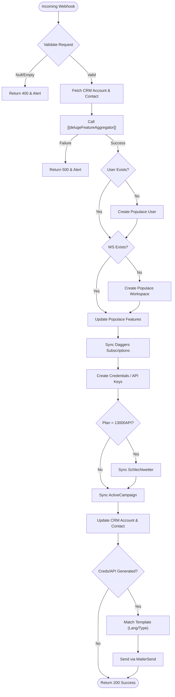

**Postman Documentation:** [Link to API Collection Placeholder]

---

## Overview
The `delugeWorkspaceAndPermissionsHandler` is a central orchestration script within the Cordulus ecosystem. It is typically triggered via a webhook (from Zoho Billing or a CRM workflow) to synchronize a customer's subscription state with the technical infrastructure. It manages the lifecycle of Populace users and workspaces, synchronizes subscription data with Daggers, generates security credentials via Tickets, and ensures the Zoho CRM data remains the "Source of Truth" for feature flags. Finally, it automates onboarding communications by sending localized activation emails.

## Technical Contract
- **Input:** `crmAPIRequest` (String) - A JSON string containing the request body with `orgId`, `customerId`, `zcrmAccId`, `zcrmContactId`, and subscription details.
- **Output:** `String` - A JSON-formatted CRM API response containing a status code (200, 400, or 500) and a success/failure message.
- **Primary Entities:** 
    - **Zoho CRM:** Accounts, Contacts, Service Plans.
    - **External Systems:** Populace (User/Workspace Management), Daggers (Subscription Service), Tickets (Credential Service), Schlechtwetter (API Service), ActiveCampaign (Marketing), MailerSend (Transactional Email).

## Dependency Map
This script orchestrates the following internal functions and external services:

| Function / Service | Purpose | Criticality |
| --- | --- | --- |
| [[delugeFeatureAggregator]] | Determines the total set of features/entitlements based on all active subscriptions. | High |
| [[delugePopulaceConnector]] | Handles creation and updates of Users, Workspaces, and feature permissions in the Populace DB. | High |
| [[delugeCroplineMembershipHandler]] | Retrieves the specific Distributor admin user ID for membership assignment. | Medium |
| [[delugeDaggersConnector]] | Synchronizes detailed subscription metadata to the Daggers platform. | High |
| [[delugeTicketsConnector]] | Generates user passwords and API keys. | Medium |
| [[delugeSchlechtwetterConnector]] | Manages access to the Schlechtwetter API for specific plan codes. | Low |
| [[delugeActiveCampaignHandler]] | Adds contacts to specific marketing and onboarding lists. | Low |
| [[delugeMailersendConnector]] | Sends transactional emails using templates matched by language and event type. | Medium |
| [[delugeSendErrorAlert]] | Dispatches error notifications to Slack/System Admins. | High |

## Logic Flow

## Core Logic Sections

### 1. Initialization and Aggregation
The script validates the incoming payload and retrieves basic Account and Contact info. It then delegates the complex logic of "what does this customer actually own?" to the `[[delugeFeatureAggregator]]`. This ensures that even if a customer has multiple overlapping subscriptions, the resulting permission set is consistent.

### 2. Populace Infrastructure Orchestration
Using the `[[delugePopulaceConnector]]`, the script ensures a User and Workspace exist. It then pushes a payload of booleans (e.g., `legacyWeather`, `weatherNetwork`) to Populace. 
- **Denmark Specifics:** It includes conditional checks for `addFieldsByCvr` and `heightMapsKortforsyningen` which are only relevant for Danish customers.
- **Distributor Memberships:** If `legacySatellite` is active, it automatically adds the distributor's admin user to the workspace via `[[delugeCroplineMembershipHandler]]`.

### 3. Subscription & Credential Sync
- **Daggers:** The aggregated subscription list is sent to Daggers to ensure the data processing pipeline knows which datasets the workspace is allowed to access.
- **Tickets:** If the customer lacks credentials but has entitled features, a password is generated. If the `weatherDataAPI` plan is active, an API key is either created or deleted based on the current status.

### 4. Zoho CRM Synchronization
The script performs a bulk update on the CRM Account and Contact records. It maps the technical feature booleans back to CRM fields and stores external IDs (Populace Workspace ID, User ID, ActiveCampaign ID).

### 5. Automated Communication (MailerSend)
The script looks up `Service Plan` records in the CRM to find template mappings.
- **Language Logic:** It attempts to find a template matching the customer's language. 
- **Fallback:** If no match is found, it defaults to English (`en`).
- **Events:** It handles "Account Activation" (password) and "API Token Activation" (API Key) separately, potentially sending two different emails if both are generated.

## Developer Notes

> [!WARNING]
> This script is highly dependent on the structure of the `Service Plans` module in CRM. If the `Template_Mappings` subform is missing or template URLs are incorrectly formatted, activation emails will fail.

> [!IMPORTANT]
> The script uses `trigger: {workflow}` when updating the CRM Account. This is intentional to ensure that any downstream automation (like reporting or further syncs) is triggered after the workspace creation.

> [!TIP]
> Section 7 (ActiveCampaign) has been updated to use a unified `Map` payload when calling `[[delugeActiveCampaignHandler]]`. This prevents issues associated with positional arguments and allows for easier future expansion of the contact metadata being synced.

> [!NOTE]
> All external connector calls (`Populace`, `Daggers`, `Tickets`, `Schlechtwetter`) are expected to handle their own internal logging and Slack alerts. This script focuses on high-level flow control and halting execution if a critical step fails.

## Change Log
- **2026-03-19T15:30:49.368Z:** Initial creation of documentation via DeluluDocu.
- **2026-03-19T21:17:50.789Z:** Cleaned up redundant/misleading comments in Section 8 (CRM Updates) and Section 9 (Email Automation). No logic changes made. Updated Mermaid diagram to include Section 7 (ActiveCampaign).
- **2026-03-27T13:30:33.724Z:** Refactored Section 7 to pass a single `Map` payload to `[[delugeActiveCampaignHandler]]` instead of multiple positional arguments. This improves the robustness of the integration and aligns with the interface used by other connectors.