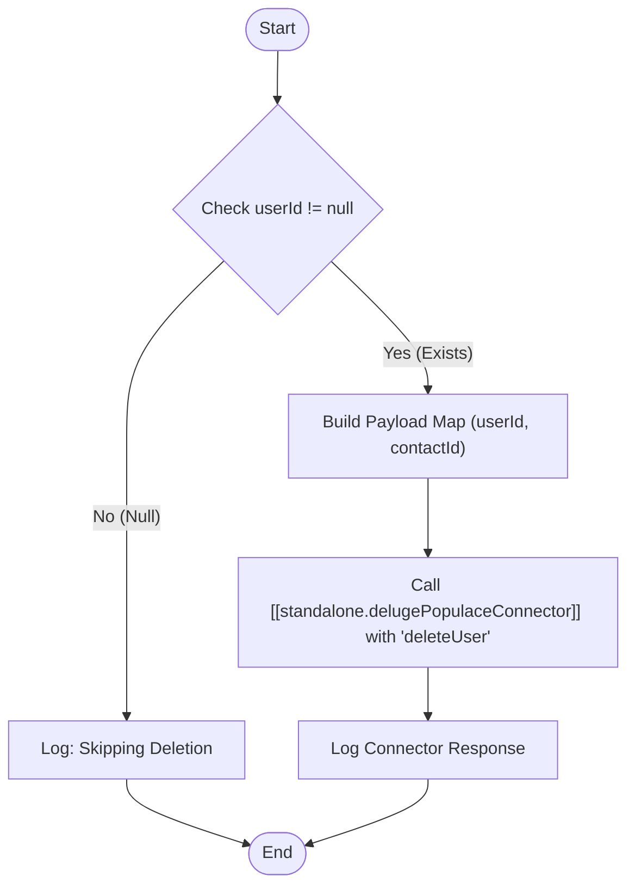

**Postman Documentation:** [Link to API Collection Placeholder]

---

## Overview
The `delugeTriggerDeletePopulaceUser` function serves as an orchestration layer within the Cordulus ecosystem to initiate the removal of a user from the external "Populace" system. It acts as a bridge between CRM Contact logic and the specialized connector script. Its primary role is to validate the presence of a Populace User ID before attempting an external API call, ensuring that resources are not wasted on invalid requests.

## Technical Contract
- **Input:** 
    - `Int contactId`: The unique CRM identifier for the Contact record.
    - `String userId`: The external identifier for the user within the Populace system.
- **Output:** `void` (Side effect: Executes an external API call via a connector and logs results).
- **Primary Entities:** 
    - Zoho CRM (Contacts)
    - Populace (External User Management System)

## Dependency Map
This script orchestrates the following internal functions and external services:

| Function / Service                    | Purpose                                                                         | Criticality |
| ------------------------------------- | ------------------------------------------------------------------------------- | ----------- |
| [[standalonedelugePopulaceConnector]] | Handles the actual HTTP communication and authentication with the Populace API. | High        |

## Logic Flow

## Core Logic Sections

### 1. Guard Clause / Validation
The script first checks if the `userId` parameter is populated. This is a critical safety check; if a CRM Contact has no associated Populace User ID, the script gracefully exits and logs the skip, preventing the connector from failing due to missing parameters.

### 2. Payload Preparation
If a `userId` is present, a `Map` is constructed. It includes both the `userId` (required by Populace for the deletion) and the `contactId` (used for internal tracking/logging within the connector).

### 3. Connector Invocation
The script calls `[[standalone.delugePopulaceConnector]]`, passing the action string `"deleteUser"`. This pattern follows a modular architecture where the trigger script does not need to know the endpoint URL or authentication headers, only the action it wishes to perform.

## Developer Notes

> [!TIP]
> This script is designed to be called from a "Before Delete" or "After Update" workflow on the Contacts module. It abstracts the complexity of the API call into a single line.

> [!IMPORTANT]
> Since this function is `void`, it does not return the success or failure status to the calling process. It relies on `info` statements for debugging. If business logic requires taking action based on a failed deletion, the return type should be updated to `Map` or `String`.

## Change Log
- **2026-03-19T18:49:22.557Z:** Initial creation of documentation via DeluluDocu.