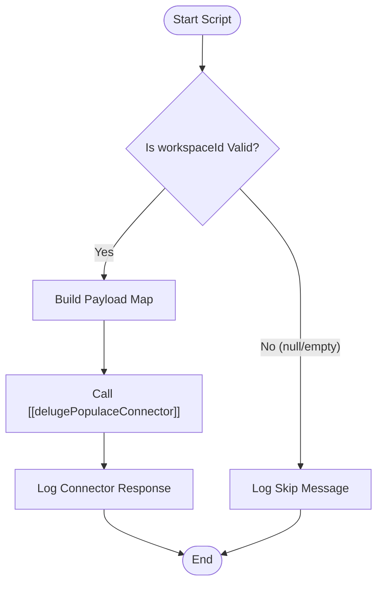

**Postman Documentation:** [Link to API Collection Placeholder]

---

## Overview
The `delugeTriggerDeletePopulaceWorkspace` function serves as an orchestration bridge within the Zoho ecosystem. Its primary purpose is to trigger the deletion of a remote workspace in the Populace system whenever an Account record is removed or a deletion workflow is initiated. It acts as a safety wrapper that validates the existence of a Workspace ID before passing the execution to a specialized standalone connector.

## Technical Contract
- **Input:** 
    - `accountId` (Int): The unique identifier for the Zoho CRM Account.
    - `workspaceId` (String): The identifier for the specific workspace within the Populace platform.
- **Output:** `void` (Side Effect: Triggers an external API call via connector).
- **Primary Entities:** 
    - Accounts (Zoho CRM)
    - Populace Workspace (External)

## Dependency Map
This script orchestrates the following internal functions and external services:

| Function / Service | Purpose | Criticality |
| --- | --- | --- |
| [[delugePopulaceConnector]] | Executes the actual REST API call to the Populace API using the provided action and payload. | High |

## Logic Flow

## Core Logic Sections

### 1. Input Validation
The script first verifies that `workspaceId` is neither null nor an empty string. This prevents unnecessary overhead or API errors that would occur if the connector were called without a target destination.

### 2. Payload Preparation
If validation passes, a `Map` is initialized. The script packages both the `workspaceId` and the `accountId` into this map. While the `workspaceId` is likely used for the endpoint URL construction, the `accountId` is included for logging or verification purposes within the downstream connector.

### 3. External Trigger
The script invokes the `standalone.delugePopulaceConnector` function using the `"deleteWorkspace"` action string. This modular approach ensures that the specific logic for authentication and API headers is abstracted away from this trigger script.

## Developer Notes

> [!IMPORTANT]
> This function does not handle the actual deletion logic or API error states (e.g., 404 or 500 errors from Populace). It simply passes the request to the connector. Failure of the external API call will be logged via the `info` statement but will not halt the CRM process.

> [!TIP]
> This script is designed to be idempotent; if it is called multiple times for the same `workspaceId`, the downstream connector/API should ideally handle the "Already Deleted" state gracefully.

## Change Log
- **2026-03-19T18:52:15.141Z:** Initial creation of documentation via DeluluDocu.