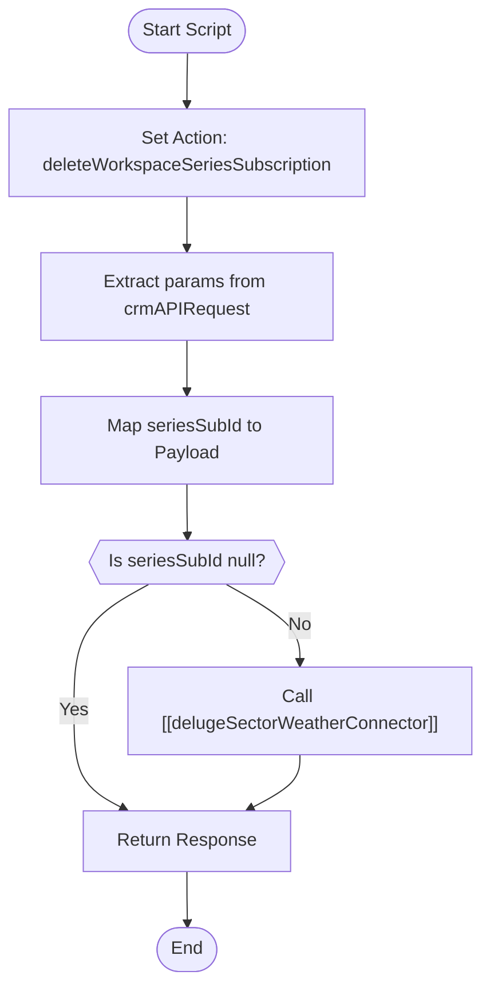

**Postman Documentation:** [Link to API Collection Placeholder]

---

## Overview
This function serves as a specialized trigger within the SectorWeather integration ecosystem. Its primary purpose is to facilitate the deletion of a specific Workspace Series Subscription. It acts as an abstraction layer that extracts the necessary subscription ID from an incoming CRM API request and passes the command to the central SectorWeather connector.

## Technical Contract
- **Input:** `String crmAPIRequest` (Expected to be a JSON string or Map containing a "params" object with `seriesSubId`).
- **Output:** `string` (The response from the downstream connector, typically containing success/error status).
- **Primary Entities:** SectorWeather API, Zoho CRM (via API Request).

## Dependency Map
This script orchestrates the following internal functions and external services:

| Function / Service | Purpose | Criticality |
| --- | --- | --- |
| [[delugeSectorWeatherConnector]] | Handles the low-level authentication and HTTP communication with the SectorWeather API. | High |

## Logic Flow

## Core Logic Sections

### 1. Initialization and Payload Construction
The script defines the specific action string (`deleteWorkspaceSeriesSubscription`) required by the downstream connector. It parses the `crmAPIRequest` to isolate the `seriesSubId`, which is the unique identifier for the subscription intended for removal.

### 2. Connector Invocation
The script performs a basic null check on the `seriesSubId`. If a valid ID is present, it invokes the `[[delugeSectorWeatherConnector]]`, passing both the action type and the payload. The result of this external API call is captured and returned to the original caller.

## Developer Notes

> [!CAUTION]
> If `seriesSubId` is null, the script currently returns the `response` variable without explicitly initializing it to a default value (like an error map). This may cause a "Variable not defined" error or return `null` depending on the environment context.

> [!TIP]
> This script is designed to be called by Zoho CRM Buttons or Workflows that pass data via the `crmAPIRequest` structure. Ensure the caller sends the parameters nested inside a `"params"` key.

## Change Log
- **2026-03-19T18:20:04.333Z:** Initial creation of documentation via DeluluDocu.