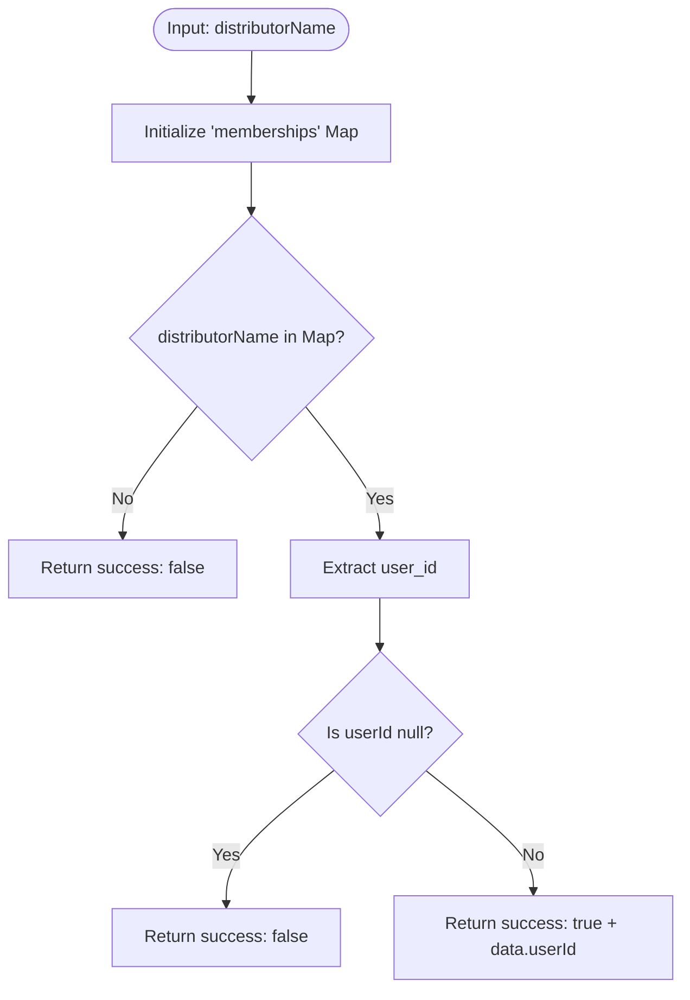

**Postman Documentation:** [Link to API Collection Placeholder]

---

## Overview
The `delugeCroplineMembershipHandler` function serves as a centralized lookup utility within the Cordulus ecosystem. Its primary purpose is to map specific distributor names (e.g., "Baltic Agro Estonia", "Danish Agro") to their corresponding administrative User IDs. This function is typically triggered by onboarding or membership management workflows where a distributor's specific admin user must be identified to perform downstream actions like record assignment or permission granting.

## Technical Contract
- **Input:** 
    - `distributorName` (String): The exact technical name of the distributor.
- **Output:** 
    - `Map` (Returned as String): A JSON-structured map containing:
        - `success`: Boolean indicating if a match was found.
        - `data`: A nested map containing `userId` (String) if successful.
- **Primary Entities:** 
    - `Internal Membership Map`: A hardcoded dictionary of distributors and IDs.

## Dependency Map
This script is a self-contained utility and does not call external internal functions or services.

| Function / Service | Purpose | Criticality |
| --- | --- | --- |
| None | Self-contained lookup logic | N/A |

## Logic Flow

## Core Logic Sections

### 1. Static Data Initialization
The script begins by manually defining a lookup table (`memberships`). This map associates distributor brand names (keys) with specific user IDs (values). This acts as the "Source of Truth" for distributor-to-admin mapping.

### 2. Validation and Extraction
The function performs a two-step validation:
1. It checks if the provided `distributorName` exists as a key in the map.
2. It verifies that the retrieved `user_id` for that distributor is not null.

### 3. Response Construction
If both validations pass, it constructs a success object containing the `userId`. Otherwise, it returns a failure flag to prevent the calling script from processing invalid data.

## Developer Notes

> [!TIP]
> This function is highly efficient for lookups as it avoids database overhead by using a local map.

> [!CAUTION]
> **Hardcoded IDs:** User IDs are hardcoded within the script. If a distributor's admin user changes in the system, this script **must** be updated manually to reflect the new `user_id`.

> [!WARNING]
> **Case Sensitivity:** The `distributorName` lookup is case-sensitive. Ensure the calling function passes the string exactly as defined in the `memberships.put` statements (e.g., "Hankkija Oy" vs "hankkija oy").

## Change Log
- **2026-03-19T15:34:09.985Z:** Initial creation of documentation via DeluluDocu. 
- **2024-05-20:** Added "Norwegian Agro Machinery" and "Swedish Agro" to the membership mapping.