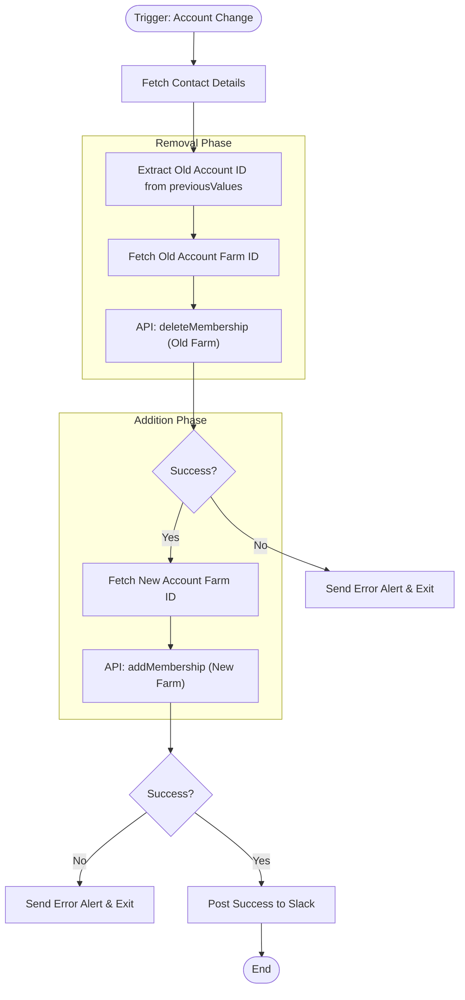

**Postman Documentation:** [Link to API Collection Placeholder]

---

## Overview
The `delugeMoveUserToOtherWorkspace` function automates the migration of a user between "Workspaces" (Farms) in the external Populace system when their associated Account changes within Zoho CRM. 

It is triggered by a CRM Workflow on the Contacts module when the `Account_Name` field is updated. The script ensures that the user is removed from the membership list of the old Account's workspace and added to the new one, maintaining role consistency across the transition.

## Technical Contract
- **Input:** 
    - `String previousValues`: A map/string containing the record's values prior to the update (used to identify the old Account).
    - `Int AccountId`: The ID of the newly associated Zoho CRM Account.
    - `Int contactId`: The ID of the Zoho CRM Contact being moved.
- **Output:** `void` (Side-effect: API updates to Populace and notifications to Slack).
- **Primary Entities:** 
    - `Zoho CRM Contacts`
    - `Zoho CRM Accounts`
    - `Populace API` (via Connector)
    - `Slack`

## Dependency Map
This script orchestrates the following internal functions and external services:

| Function / Service | Purpose | Criticality |
| --- | --- | --- |
| [[delugePopulaceConnector]] | Executes the `deleteMembership` and `addMembership` API calls to the Populace system. | CRITICAL |
| [[delugeSendErrorAlert]] | Dispatches error logs and notifications if API calls fail or data is missing. | MEDIUM |
| [[delugePostSuccessMessageToSlack]] | Posts a formatted success message to a specific Slack channel for operational monitoring. | LOW |

## Logic Flow

## Core Logic Sections

### 1. Context & Data Initialization
The script retrieves the current Contact's metadata, specifically the `User_Type` (which determines the role in the target workspace) and the `Kanisa_User_ID` (the unique identifier for the user in the Populace system).

### 2. De-provisioning (Old Workspace)
Using the `previousValues` map, the script identifies the `OldAccountId`. It fetches the corresponding `Kanisa_Farm_ID` from the old Account record. If valid IDs exist, it calls the `delugePopulaceConnector` to remove the user's membership from that specific workspace.

### 3. Provisioning (New Workspace)
The script fetches the `Kanisa_Farm_ID` for the newly assigned `AccountId`. It then executes an `addMembership` action via the connector, passing the user's role (`User_Type`) to ensure permissions remain consistent.

### 4. Visibility & Logging
Upon successful completion of both the "Delete" and "Add" operations, the script constructs a detailed Slack message containing hyperlinks to the Zoho CRM Contact, the New Account, and the Populace Dashboard.

## Developer Notes

> [!WARNING]
> The script contains hardcoded Zoho CRM URLs (Europe DC: `crm.zoho.eu`) and a hardcoded Slack Channel ID (`CC61ZM8PN`). If the organization migrates data centers or changes Slack channels, these must be updated manually.

> [!IMPORTANT]
> The `previousValues` parameter is expected to be a Map or a String that Deluge can treat as a Map. If the workflow trigger does not pass this correctly, the "Remove from Old Workspace" logic will fail silently or throw an error.

> [!NOTE]
> If the `OldWorkspaceId` or `PopulaceUserId` are null, the deletion step is skipped without throwing an error, but the script proceeds to the addition step.

## Change Log
- **2026-03-19T19:39:12.789Z:** Initial creation of documentation via DeluluDocu.