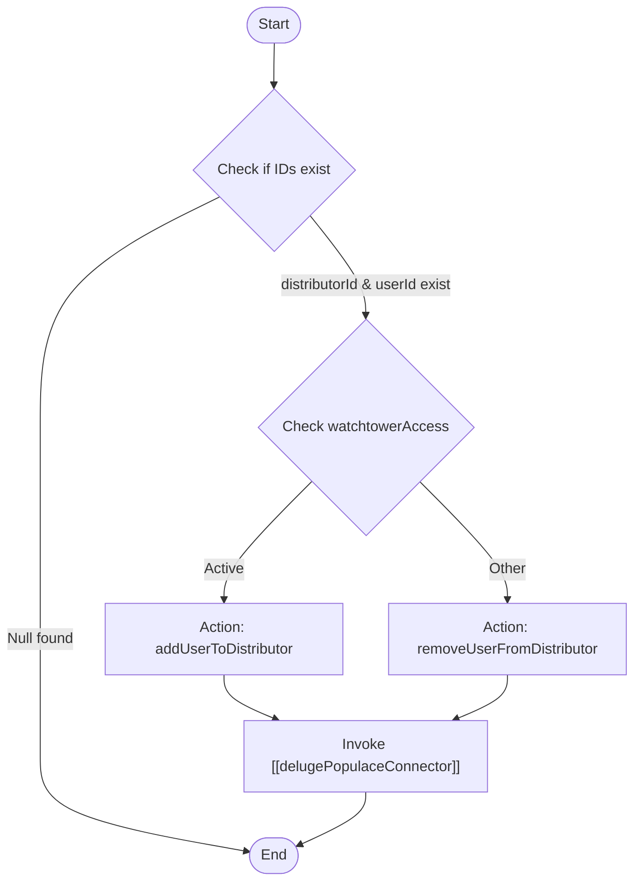

**Postman Documentation:** [Link to API Collection Placeholder]

---

## Overview
The `delugeSyncUserToPopulaceDistributor` function is an orchestration script designed to synchronize user-distributor relationships between Zoho CRM and the Populace platform. It is typically triggered when a Contact's `Watchtower Access` status or associated Distributor changes. Its primary role is to determine whether a user should be added to or removed from a distributor's scope within Populace and then delegate the API execution to a specialized connector function.

## Technical Contract
- **Input:** 
    - `String userId`: The unique identifier for the user in the Populace system.
    - `String distributorId`: The unique identifier for the distributor.
    - `String watchtowerAccess`: A picklist value representing the access status (e.g., "Active").
- **Output:** `void` (Side effect: Invokes an external API connector).
- **Primary Entities:** 
    - Populace (External User Management)
    - Distributor (Organization Entity)

## Dependency Map
This script orchestrates the following internal functions and external services:

| Function / Service | Purpose | Criticality |
| --- | --- | --- |
| [[delugePopulaceConnector]] | Handles the actual REST API communication with the Populace endpoint using the determined action and payload. | High |

## Logic Flow

## Core Logic Sections

### 1. Input Validation
The script performs a safety check to ensure both `distributorId` and `userId` are present. If either is null, the script terminates silently to prevent malformed API calls to the connector.

### 2. Action Determination
The script uses a conditional logic block to map Zoho picklist values to Populace API actions:
- If `watchtowerAccess` equals **"Active"** (case-insensitive), the action is set to `addUserToDistributor`.
- For any other value (or empty string), the action defaults to `removeUserFromDistributor`.

### 3. Delegation
Once the action and payload (`userId` and `distributorId`) are prepared, the script hands off execution to the standalone utility function `[[delugePopulaceConnector]]`.

## Developer Notes

> [!IMPORTANT]
> This script currently treats any value that is not "Active" as a command to **remove** access. Ensure that empty values or "Pending" statuses are intended to result in access removal before deploying changes to the picklist logic.

> [!NOTE]
> The function relies entirely on the response handling of `[[delugePopulaceConnector]]`. It does not currently perform any retry logic or local error logging if the connector fails.

> [!TIP]
> To troubleshoot synchronization issues, check the Zoho "Info" logs to verify the action string and IDs being passed to the connector.

## Change Log
- **2026-03-19T18:51:20.306Z:** Initial creation of documentation via DeluluDocu.