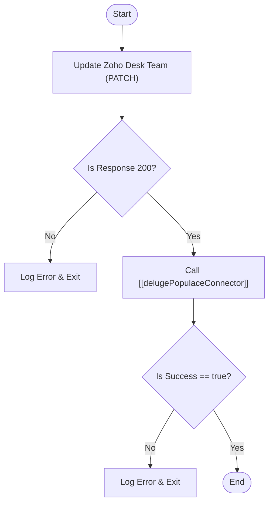

**Postman Documentation:** [Link to API Collection Placeholder]

---

## Overview
This function synchronizes distributor/account data between Zoho Desk and the internal "Populace" system. It is primarily triggered when distributor details (like names or country assignments) are modified, ensuring that the corresponding "Team" in Zoho Desk and the distributor record in the Populace database remain consistent.

## Technical Contract
- **Input:** 
    - `accountId` (Int): The unique identifier for the account.
    - `country` (String): The country associated with the distributor.
    - `accountName` (String): The name of the account/distributor.
    - `teamId` (String): The Zoho Desk Team ID to be updated.
    - `distributorId` (String): The Populace-specific ID for the distributor.
    - `departmentId` (String): The Zoho Desk Department ID (provided but currently unused in the logic).
- **Output:** `void` (Side effects: Updates external Desk and Populace records).
- **Primary Entities:** 
    - Zoho Desk (Teams)
    - Populace (Distributor Records)

## Dependency Map
This script orchestrates the following internal functions and external services:

| Function / Service | Purpose | Criticality |
| --- | --- | --- |
| [[delugePopulaceConnector]] | Facilitates the API bridge to the Populace system to update distributor details. | High |
| Zoho Desk API | Used to update the Team name within the Desk environment. | High |

## Logic Flow

## Core Logic Sections

### 1. Zoho Desk Team Synchronization
The script initiates a `PATCH` request to the Zoho Desk API. It updates the `name` attribute of a specific Team (identified by `teamId`) to match the provided `accountName`. This ensures that support agents in Desk see the most current distributor name.

### 2. Populace Distributor Update
If the Desk update is successful, the script constructs a payload containing the account ID, name, country, and distributor ID. This payload is passed to the internal `[[delugePopulaceConnector]]` function using the `updateDistributor` action, syncing the changes to the internal database.

## Developer Notes

> [!IMPORTANT]
> The Zoho Desk API call is hardcoded to the `.eu` multi-region (`https://desk.zoho.eu`). If the organization migrates to a different DC (e.g., .com or .in), this URL must be updated.

> [!WARNING]
> The function relies on a Zoho Desk connection named `zohodesk`. Ensure this connection has the `ZohoDesk.teams.UPDATE` (or equivalent) scope authorized.

> [!TIP]
> The `departmentId` parameter is passed into the function signature but is not utilized in the current script logic. It may be intended for future filtering or multi-department team management.

## Change Log
- **2026-03-19T18:49:10.647Z:** Initial creation of documentation via DeluluDocu.