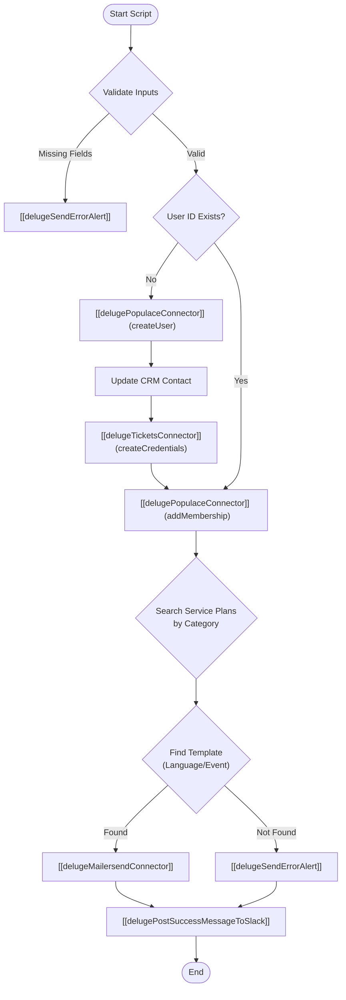

**Postman Documentation:** [Link to API Collection Placeholder]

---

## Overview
The `delugePopulaceMembershipHandler` is a central orchestration script responsible for the end-to-end provisioning of users within the Cordulus "Populace" platform. It handles user creation, credential generation, workspace membership assignment, and localized activation emails.

This function is typically triggered following a successful subscription or account setup in Zoho CRM. It ensures that the digital representation of a customer (Contact) is correctly mapped to their technical workspace in Populace and that they receive the necessary login credentials via MailerSend.

## Technical Contract
- **Input:** 
    - `zcrmContactId` (String): The unique ID of the Contact in Zoho CRM.
    - `email` (String): The user's email address.
    - `firstName` (String): User's first name.
    - `lastName` (String): User's last name.
    - `language` (String): Preferred language code (e.g., "da", "en").
    - `role` (String): The role to assign in Populace (e.g., "admin", "viewer").
    - `workspaceId` (String): The Populace Workspace ID.
    - `userId` (String): Existing Populace User ID (if available).
    - `action` (String): The operation type (e.g., "createMembership").
    - `category` (String): Used to look up the correct Service Plan for email templates.
    - `accountName` (String): The name of the organization.
    - `zcrmAccountId` (String): The unique ID of the Account in Zoho CRM.
- **Output:** Void (Side effects: CRM updates, external API calls, Slack notifications).
- **Primary Entities:** Zoho CRM (Contacts, Service Plans), Populace API, Tickets (Internal Credential Service), MailerSend, Slack.

## Dependency Map
This script orchestrates the following internal functions and external services:

| Function / Service | Purpose | Criticality |
| --- | --- | --- |
| [[delugeSendErrorAlert]] | Sends error notifications to Slack/Monitoring. | High |
| [[delugePopulaceConnector]] | Interfaces with the Populace API for user and membership management. | High |
| [[delugeTicketsConnector]] | Generates secure passwords for new accounts. | High |
| [[delugeMailersendConnector]] | Sends transactional activation emails. | Medium |
| [[delugePostSuccessMessageToSlack]] | Posts a formatted success confirmation to a specific Slack channel. | Low |

## Logic Flow

## Core Logic Sections

### 1. Fail-Early Input Validation
The script begins by mapping 11 mandatory fields. It iterates through the map and identifies any null or empty values. If any are missing, it halts execution and sends a critical alert to prevent downstream API failures.

### 2. User & Credential Provisioning
If a `userId` is not provided, the script calls the `createUser` action via the Populace Connector. Upon success, it immediately updates the CRM Contact record with the new `Kanisa_User_ID`. Subsequently, it requests a password from the Tickets Connector. This password is only generated for brand-new users.

### 3. Membership Assignment
Regardless of whether the user was just created or already existed, the script executes the `addMembership` action to link the user to the specified `workspaceId` with the designated `role`.

### 4. Dynamic Email Automation
The script performs a lookup on the `Service_Plans` module based on the subscription `category`. It drills down into a subform (`Template_Mappings`) to find the correct MailerSend template ID. 
- It first attempts to match the user's specific `language`.
- If no match is found, it falls back to "en" (English).
- Two types of events are handled: "Account Activation" (includes password) and "Membership Activation".

## Developer Notes

> [!IMPORTANT]
> The script assumes that the `Service_Plans` module contains a subform named `Template_Mappings` with fields for `Language`, `Event_Type`, and `Template` (URL containing the ID). If the Service Plan configuration is missing or the URL format changes, email delivery will fail.

> [!CAUTION]
> The script uses a hardcoded Slack channel ID `CC61ZM8PN` for success notifications. If the organization's Slack workspace changes or the channel is archived, this will cause a non-critical error at the end of execution.

> [!TIP]
> The password is only captured during the `userCreated == true` block. For existing users being added to new memberships, the "Account Activation" email will not contain a password, as they are expected to already possess one.

## Change Log
- **2026-03-19T18:49:16.438Z:** Initial creation of documentation via DeluluDocu.
- **2026-03-19T18:49:16.438Z:** Implemented multi-tier template search logic (Specific Language -> Fallback 'en').