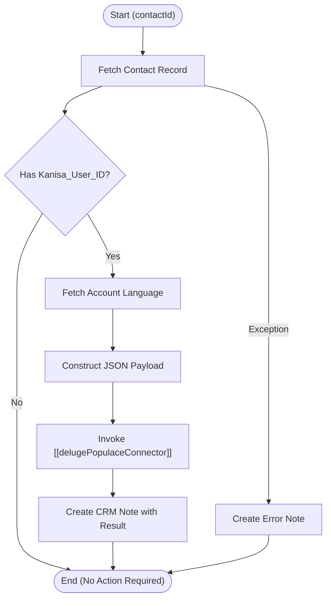

**Postman Documentation:** [Link to API Collection Placeholder]

---

## Overview
The `delugeTriggerUpdatePopulaceUser` function serves as an orchestration script designed to synchronize CRM Contact data with the external "Populace" platform. It is typically triggered by a Workflow Rule when specific fields (like Email, Name, or Language) are updated on a Contact record. The script retrieves associated account details to determine language preferences, formats the data, and passes it to a standalone connector for API execution.

## Technical Contract
- **Input:** `Int contactId` (The unique ID of the Zoho CRM Contact)
- **Output:** `void` (Side effects include creating a CRM Note and invoking an external API via a connector)
- **Primary Entities:** `Contacts`, `Accounts`, `Notes`, `Populace User API`

## Dependency Map
This script orchestrates the following internal functions and external services:

| Function / Service | Purpose | Criticality |
| --- | --- | --- |
| [[delugePopulaceConnector]] | Standalone utility to handle the HTTP request and authentication for the Populace API. | High |
| `zoho.crm.getRecordById` | Fetches the Contact and Account details from Zoho CRM. | High |
| `zoho.crm.createRecord` | Records the outcome of the sync as a Note attached to the Contact. | Low |

## Logic Flow

## Core Logic Sections

### 1. Data Retrieval & Validation
The script first retrieves the Contact record using the provided `contactId`. It checks for the existence of `Kanisa_User_ID`. This is a "Guard Clause"—if the contact is not associated with a Populace user, the script terminates immediately to save execution credits.

### 2. Context Resolution (Language)
To ensure the user experience is localized, the script attempts to pull the `Language` field from the parent Account. It defaults to "en" (English) if the Account is missing or the field is null.

### 3. External Sync (Connector Call)
Instead of handling HTTP headers and endpoints locally, the script delegates the API heavy-lifting to `[[delugePopulaceConnector]]`. It maps CRM fields (`Email`, `First_Name`, `Last_Name`) to the expected external keys.

### 4. Audit Trail & Error Handling
Every execution attempt results in a CRM Note. This provides visibility to end-users (Sales/Support) regarding whether the sync succeeded or if a technical failure occurred, without requiring them to check the Deluge logs.

## Developer Notes

> [!CAUTION]
> The line `accountId = contactRecord.get("Account_Name").get("id");` will cause the script to crash if the Contact is "Private" (no Account associated). A null-check should be added for `contactRecord.get("Account_Name")` before calling `.get("id")`.

> [!TIP]
> The script uses `language.toLowerCase()`. Ensure that the values in the CRM "Language" picklist match the ISO codes or strings expected by the Populace API (e.g., "en", "da", "de").

## Change Log
- **2026-03-19T18:51:52.002Z:** Initial creation of documentation via DeluluDocu.