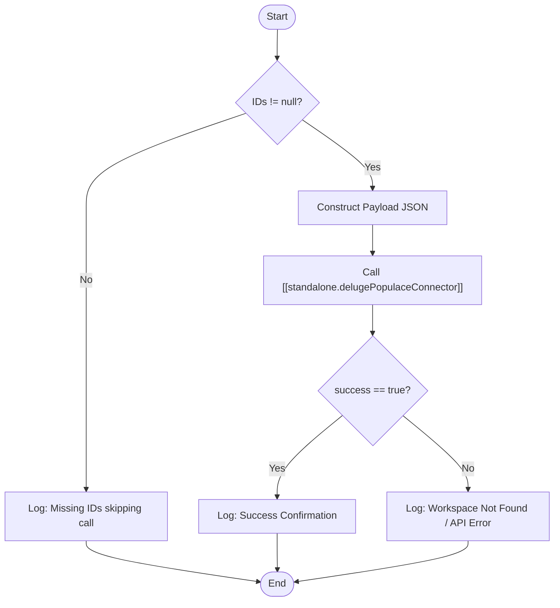

**Postman Documentation:** [Link to API Collection Placeholder]

---

## Overview
The `delugeTriggerAddWorkspaceToDistributor` function is an automation utility designed to link a specific Workspace ID to a Distributor ID within the Populace external system. It acts as a bridge between Zoho CRM data (where the Distributor and Workspace relationship is defined) and the Cordulus Populace platform, ensuring that workspace access is correctly provisioned or categorized under the appropriate distributor.

## Technical Contract
- **Input:** 
    - `distributorId` (String): The unique identifier for the Distributor in Populace.
    - `workspaceId` (String): The unique identifier for the Workspace to be assigned.
- **Output:** `void` (Side effects: Logs execution status and performs external API call via connector).
- **Primary Entities:** 
    - Zoho CRM (Accounts/Distributors)
    - Populace (External Workspace Management System)

## Dependency Map
This script orchestrates the following internal functions and external services:

| Function / Service | Purpose | Criticality |
| --- | --- | --- |
| [[standalone.delugePopulaceConnector]] | Handles the API authentication and communication with the Populace platform. | High |

## Logic Flow

## Core Logic Sections

### 1. Input Validation
The script first checks if both the `distributorId` and `workspaceId` are provided. If either is missing, it skips the execution to prevent malformed API requests and logs a specific warning noting that the linked Distributor Account in Zoho CRM likely lacks a Populace ID.

### 2. External Integration
The script utilizes the `standalone.delugePopulaceConnector` with the action `"addWorkspaceToDistributor"`. This abstracts the complexities of header management and endpoint construction, passing only the workspace/distributor map as a payload.

### 3. Response Interpretation & Logging
The function parses the response from the connector. It specifically looks for a `success` boolean. 
- If `true`, it confirms the association. 
- If `false` (or missing), it logs a failure message, specifically highlighting that the Workspace ID might not exist in the Populace environment.

## Developer Notes

> [!IMPORTANT]
> This script assumes that if the API returns a failure, the root cause is that the `workspaceId` does not exist. While this is the most common cause, developers should check the `putDistributorResponse` in the logs for other potential errors (e.g., Distributor ID mismatch or Permission issues).

> [!TIP]
> Ensure that the `distributorId` passed to this function is the technical ID used by Populace, not necessarily the Zoho CRM Record ID.

## Change Log
- **2026-03-19T19:41:22.657Z:** Initial creation of documentation via DeluluDocu.