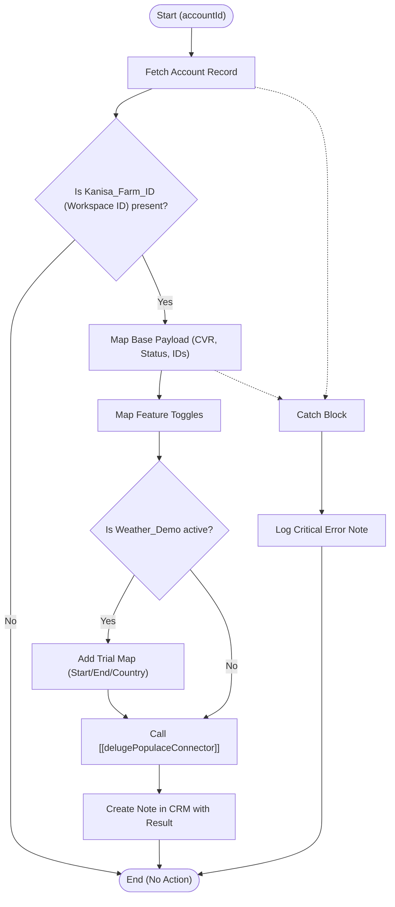

**Postman Documentation:** [Link to API Collection Placeholder]

---

## Overview
The `delugeTriggerUpdatePopulaceWorkspace` function is an automation script designed to synchronize changes from a Zoho CRM **Account** record to an external workspace management system called **Populace**. 

It is triggered when specific fields (such as feature toggles or account status) are updated in the CRM. The script aggregates these fields into a structured JSON payload and passes it to a dedicated connector function to perform the external API update. Finally, it logs the outcome of the synchronization directly on the CRM record via the Notes module for auditability.

## Technical Contract
- **Input:** `accountId` (Integer)
- **Output:** `void` (Side effects: External API call via connector and CRM Note creation)
- **Primary Entities:** `Accounts`, `Notes`, `Populace Workspace`

## Dependency Map
This script orchestrates the following internal functions and external services:

| Function / Service | Purpose | Criticality |
| --- | --- | --- |
| [[delugePopulaceConnector]] | Handles the actual HTTP communication with the Populace API. | High |
| `zoho.crm.getRecordById` | Retrieves the latest state of the Account record. | High |
| `zoho.crm.createRecord` | Logs success/failure notes back to the Account record. | Low |

## Logic Flow

## Core Logic Sections

### 1. Data Retrieval & Validation
The script first retrieves the Account record. It uses `Kanisa_Farm_ID` as the primary identifier for the external workspace. If this ID is missing, the script terminates, as there is no target destination to update.

### 2. Payload Construction
The script maps Zoho CRM field values to a specific JSON structure required by the Populace API:
- **Base Fields:** CVR/VAT number and an "active" boolean based on the CRM Account Status.
- **Features Map:** A nested object containing various toggles (e.g., `legacyWeather`, `addFieldsByCvr`).
- **Trial Logic:** If `Weather_Demo` is true, a nested `trial` object is injected containing demo dates and country data.

### 3. Connector Invocation
Instead of handling HTTP headers and endpoints directly, the script delegates the request to [[delugePopulaceConnector]]. This modular approach separates data transformation logic from network transport logic.

### 4. Status Logging
Regardless of success or failure, the script creates a CRM Note. If the API call fails, the note directs the user to check Slack for detailed technical error logs, which are likely handled within the connector itself.

## Developer Notes

> [!TIP]
> This script uses a hardcoded action string `"updateWorkspace"` when calling the connector. Ensure that any changes to the Populace API endpoint are reflected in the connector function rather than here.

> [!IMPORTANT]
> The "active" status logic is strictly mapped to the string "Active". If the CRM picklist values for `Account_Status` are modified, this logic must be updated to prevent accounts from being incorrectly marked as inactive in Populace.

> [!CAUTION]
> The script assumes all feature toggle fields in CRM return boolean values. If these fields are changed to picklists or other types, the `payload.put` logic will require explicit casting or conditional checks.

## Change Log
- **2026-03-19T18:49:02.630Z:** Initial creation of documentation via DeluluDocu.