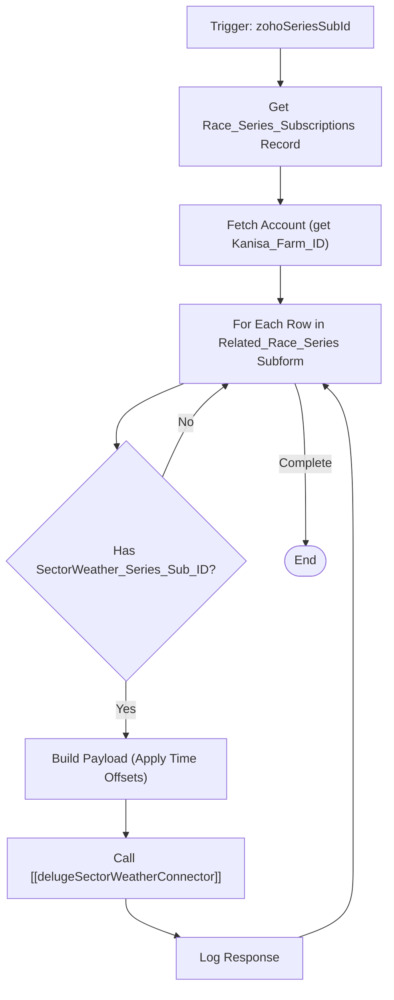

**Postman Documentation:** [Link to API Collection Placeholder]

---

## Overview
This function synchronizes race series subscription data from Zoho CRM to the external SectorWeather system. It is triggered when a `Race_Series_Subscriptions` record is updated. The script retrieves the associated account's workspace ID, iterates through the race series subform, and pushes individual subscription details (including time-shifted start/end dates) to an external API via a standalone connector.

## Technical Contract
- **Input:** `Int zohoSeriesSubId` - The unique identifier for the Race Series Subscription record in Zoho CRM.
- **Output:** `void` - Performs side-effect API calls.
- **Primary Entities:** 
    - `Race_Series_Subscriptions` (CRM Module)
    - `Accounts` (CRM Module)
    - `SectorWeather` (External System)

## Dependency Map
This script orchestrates the following internal functions and external services:

| Function / Service | Purpose | Criticality |
| --- | --- | --- |
| [[delugeSectorWeatherConnector]] | Handles the actual HTTP communication and authentication with the SectorWeather API. | High |
| Zoho CRM API | Used to retrieve the primary record and the parent Account details. | High |

## Logic Flow

## Core Logic Sections

### 1. Data Initialization & Retrieval
The script fetches the main subscription record and navigates the lookup to the `Account` module to retrieve the `Kanisa_Farm_ID`. This ID is critical as it maps the Zoho Account to a "Workspace" in the SectorWeather system.

### 2. Subform Parsing
The script iterates through the `Related_Race_Series` subform. It specifically looks for rows where a `SectorWeather_Series_Sub_ID` exists, ensuring that only records already linked to the external system are updated.

### 3. Date Formatting and Time Offsets
The script applies specific business logic to the subscription timings:
- **Start Time:** Adds 1 hour to the Zoho value.
- **End Time:** Adds 25 hours to the Zoho value.
- Both are formatted to ISO 8601 string format (`yyyy-MM-dd'T'HH:mm:ss'Z'`) in the UTC timezone.

### 4. External Synchronization
For every valid subform row, it constructs a payload and invokes [[delugeSectorWeatherConnector]] using the `updateWorkspaceSeriesSubscription` action.

## Developer Notes

> [!IMPORTANT]
> The script uses hardcoded time offsets (`addHour(1)` and `addHour(25)`). If the business logic for subscription buffers changes, these values must be updated here.

> [!WARNING]
> The script performs a `getRecordById` for the Account inside the main function but then executes a loop that calls an external connector. If the subform contains a large number of rows, this script may encounter Zoho Deluge execution timeout limits or URL fetch limits.

> [!NOTE]
> Ensure that the field `Kanisa_Farm_ID` on the Account module is populated; otherwise, the `workspaceId.toLong()` conversion will fail.

## Change Log
- **2026-03-19T18:19:29.323Z:** Initial creation of documentation via DeluluDocu.