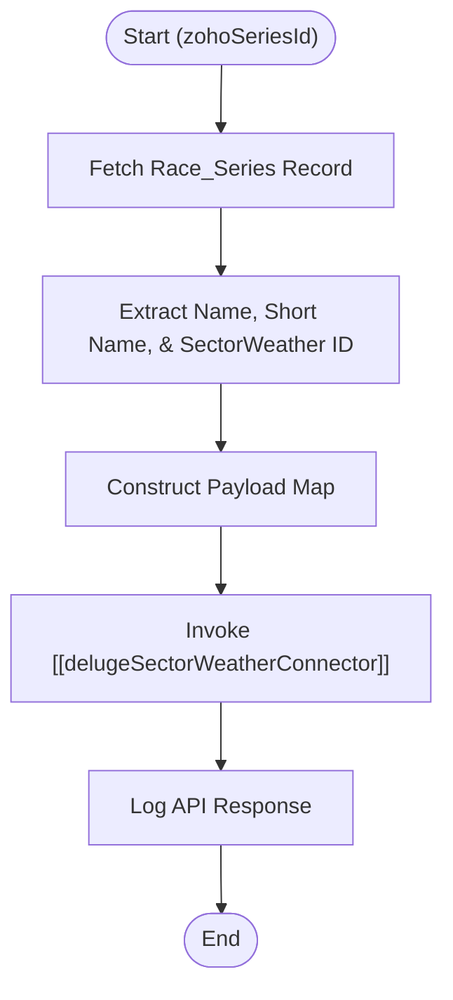

**Postman Documentation:** [Link to API Collection Placeholder]

---

## Overview
The `delugeTriggerUpdateSectorWeatherSeries` function serves as an orchestration layer within Zoho CRM. Its primary purpose is to synchronize updates made to a "Race Series" record in Zoho with the external SectorWeather system. It acts as a wrapper that prepares data and triggers the centralized `delugeSectorWeatherConnector` to perform the actual API communication.

## Technical Contract
- **Input:** `Int zohoSeriesId` (The unique Record ID of the Race Series in Zoho CRM).
- **Output:** `void` (The function executes side effects via an external function call).
- **Primary Entities:** 
    - `Race_Series` (Zoho CRM Module)
    - SectorWeather (External Service)

## Dependency Map
This script orchestrates the following internal functions and external services:

| Function / Service | Purpose | Criticality |
| --- | --- | --- |
| [[delugeSectorWeatherConnector]] | Standalone connector that handles the HTTP communication with the SectorWeather API. | High |
| Zoho CRM (Race_Series) | Source of truth for series metadata (Names and IDs). | High |

## Logic Flow

## Core Logic Sections

### 1. Initialization & Data Retrieval
The script sets the operation type to `updateSeries` and retrieves the full record from the `Race_Series` module using the provided `zohoSeriesId`.

### 2. Payload Construction
The script extracts key attributes required by the SectorWeather API:
- **zohoSeriesId**: The internal Zoho reference.
- **seriesId**: The external SectorWeather ID (explicitly cast to a Number).
- **name**: The full display name of the series.
- **shortName**: The abbreviated series name.

### 3. External Execution
The script delegates the actual API request to the `standalone.delugeSectorWeatherConnector` function, passing the `updateSeries` action and the constructed map.

## Developer Notes

> [!WARNING]
> The script performs a `toNumber()` conversion on the `SectorWeather_Series_ID`. If this field is empty or contains non-numeric characters in Zoho CRM, the script will throw a runtime error.

> [!TIP]
> This function is designed to be triggered by a Zoho CRM Workflow Rule or Blueprint transition whenever a Race Series record is modified.

> [!IMPORTANT]
> Error handling is currently managed within the called `[[delugeSectorWeatherConnector]]`. This wrapper function only logs the raw response via `info` statements.

## Change Log
- **2026-03-19T18:19:22.728Z:** Initial creation of documentation via DeluluDocu.