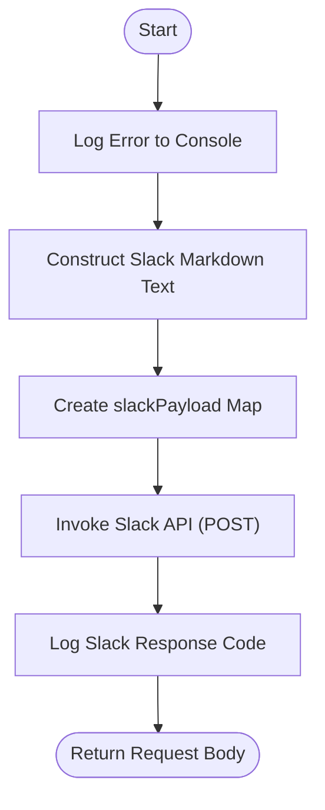

**Postman Documentation:** [Link to API Collection Placeholder]

---

## Overview
The `delugeSendErrorAlert` function is a centralized utility designed to provide real-time error reporting for the Cordulus Zoho ecosystem. It intercepts error details from other Deluge scripts and pushes a formatted notification to a dedicated Slack channel. This ensures that the development team is immediately notified of runtime failures, including the specific function that failed, the error message, and the state of the data (`requestBody`) at the time of the crash.

## Technical Contract
- **Input:** 
    - `String functionName`: The technical name of the script where the error occurred.
    - `String requestBody`: The data payload or context being processed when the error happened.
    - `String errorMessage`: The specific error description or exception message.
- **Output:** Returns the original `requestBody` as a string.
- **Primary Entities:** 
    - Slack API (`chat.postMessage`)
    - Cordulus Slack Workspace

## Dependency Map
This script orchestrates the following internal functions and external services:

| Function / Service | Purpose | Criticality |
| --- | --- | --- |
| Slack API | External communication service used to deliver the alert. | High |

## Logic Flow



## Core Logic Sections

### 1. Message Formatting
The script constructs a specific Markdown-formatted string for Slack. It uses blocks for the function name, error details (prefixed with `>`), and a code block (`` ``` ``) for the `requestBody` to ensure readability.

### 2. External Integration (Slack)
The script uses Zoho's `invokeurl` task to perform a POST request to the Slack `chat.postMessage` endpoint. It relies on a pre-configured connection named `"slack"` to handle OAuth authentication.

## Developer Notes

> [!IMPORTANT]
> This script currently has the Slack Channel ID `C09JRNLLUHH` hardcoded. If the monitoring channel changes, this script must be updated manually.

> [!CAUTION]
> If the `requestBody` is extremely large (exceeding Slack's character limit for a single message), the Slack API might return an error. Consider truncating the `requestBody` if it consistently exceeds 3000 characters.

> [!TIP]
> Always wrap calls to this function in a `try-catch` block within the calling script to ensure that an error in the error reporter doesn't halt the entire process.

## Change Log
- **2026-03-19T15:34:55.564Z:** Initial creation of documentation via DeluluDocu.