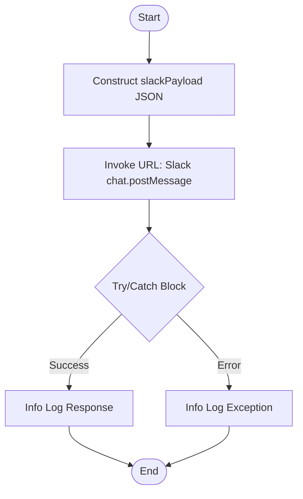

**Postman Documentation:** [Link to API Collection Placeholder]

---

## Overview
The `delugePostSuccessMessageToSlack` function is a standalone utility designed to send automated notifications to a specific Slack channel. It acts as a standardized wrapper for the Slack `chat.postMessage` API, allowing other scripts within the Cordulus ecosystem to report successful process completions, status updates, or log entries without re-implementing the API logic.

## Technical Contract
- **Input:** 
    - `String slackText`: The content of the message to be sent.
    - `String slackChannelId`: The ID of the destination Slack channel.
- **Output:** Returns an empty `string`.
- **Primary Entities:** 
    - **Slack API**: External service for message delivery.
    - **Zoho Connection**: Uses a connection named `"slack"` for OAuth authentication.

## Dependency Map
This script orchestrates the following internal functions and external services:

| Function / Service | Purpose | Criticality |
| --- | --- | --- |
| Slack API | Receives and displays the message in the workspace. | High |
| Zoho Connection ("slack") | Handles authentication headers for the API call. | High |

## Logic Flow

## Core Logic Sections

### 1. Payload Construction
The script builds a JSON object specifically formatted for the Slack API. It hardcodes the bot identity as "Cordulus" with a specific icon (`cordulus-stare`) and disables link unfurling to keep the chat history clean.

### 2. External Integration
The `invokeurl` task executes a POST request to `https://slack.com/api/chat.postMessage`. This relies on the "slack" connection being pre-configured in the Zoho environment with the necessary scopes (`chat:write`).

### 3. Exception Handling
The entire operation is wrapped in a `try...catch` block. This ensures that if the Slack API is down or the connection expires, the calling script does not crash, maintaining the stability of the primary business process.

## Developer Notes

> [!IMPORTANT]
> This function requires a Zoho Connection named exactly `slack`. If this connection is renamed or deleted, all Slack notifications across the system will fail.

> [!TIP]
> The `unfurl_links` parameter is set to `false`. If you send a message containing a URL and want the preview to appear, you would need to modify this script or create a variation.

> [!WARNING]
> This script does not return the status of the message delivery to the caller; it only logs it to the "Info" console. If the calling script needs to know if the message was actually delivered, the return type should be updated to return the `response` object.

## Change Log
- **2026-03-19T17:40:08.506Z:** Initial creation of documentation via DeluluDocu.