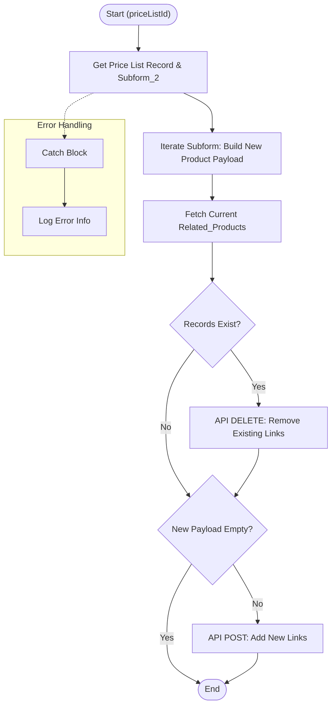

**Postman Documentation:** [Link to API Collection Placeholder]

---

## Overview
The `delugeSyncProductsToRelatedProducts` function is designed to synchronize products listed within a subform on a **Price List** record with a standard CRM Related List (Junction Object). This ensures that products managed in the UI via a subform are also accessible and queryable via the "Related Products" junction module for reporting and automation purposes.

The script follows a "purge and replace" logic: it identifies all currently linked products, removes them, and then re-establishes links based on the current state of the subform.

## Technical Contract
- **Input:** `priceListId` (String) - The unique record ID of the Price List.
- **Output:** Side effects (Record deletion and creation in Zoho CRM). Returns `void`.
- **Primary Entities:** 
    - `Price_Lists` (Source module)
    - `Subform_2` (Source subform containing Product lookups)
    - `Related_Products` (Target junction module/related list)

## Dependency Map
This script orchestrates the following internal functions and external services:

| Function / Service | Purpose | Criticality |
| --- | --- | --- |
| Zoho CRM API (v9) | Used for batch deletion and batch creation of related records | High |
| `zohocrmconnection` | OAuth connection for API calls | High |

## Logic Flow

## Core Logic Sections

### 1. Data Preparation & Mapping
The script retrieves the `Price_Lists` record to access `Subform_2`. It iterates through each row, extracts the Product ID, and constructs a JSON payload structured for the Zoho CRM Related List API.

### 2. State Reset (Purge)
To prevent duplicates and handle removed subform rows, the script fetches all records currently residing in the `Related_Products` list for that Price List. It extracts their unique junction IDs and performs a single `DELETE` call via `invokeurl`.

### 3. Link Reconstruction
If the subform contains products, the script sends a `POST` request to the Related Records endpoint. This batch-links all products identified in Step 1 to the Price List in a single operation.

## Developer Notes

> [!IMPORTANT]
> This script is hardcoded to the **.eu** Zoho domain (`https://www.zohoapis.eu`). If the environment is moved to **.com** or **.in**, these URLs must be updated.

> [!WARNING]
> The script uses a "Delete All then Add All" approach. If the `POST` call fails after a successful `DELETE` call, the related list will remain empty even if the subform has data.

> [!NOTE]
> The script relies on a custom connection named `zohocrmconnection`. This connection must have scopes for `ZohoCRM.modules.all` or specifically for the Price Lists and Related Products modules.

## Change Log
- **2026-03-19T18:57:27.360Z:** Initial creation of documentation via DeluluDocu.