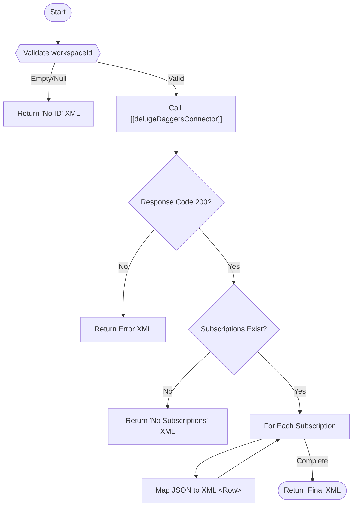

**Postman Documentation:** [Link to API Collection Placeholder]

---

## Overview
The `delugeDaggersSubscriptions` function serves as a back-end handler for a Custom Related List in Zoho CRM (likely under the Accounts module). Its primary purpose is to fetch active subscription data from the "Daggers" external system for a specific workspace and format the resulting data into the Zoho-compliant XML structure required to render a Related List UI.

## Technical Contract
- **Input:** `workspaceId` (String) - The unique identifier for the Daggers workspace.
- **Output:** `xmlResponse` (String) - A Zoho-formatted XML string containing subscription rows or error messages.
- **Primary Entities:** Zoho CRM Accounts, Daggers API Service.

## Dependency Map
This script orchestrates the following internal functions and external services:

| Function / Service | Purpose | Criticality |
| --- | --- | --- |
| [[delugeDaggersConnector]] | Acts as the middleware to handle API authentication and communication with the Daggers endpoint. | High |

## Logic Flow

## Core Logic Sections

### 1. Workspace Validation
The script first checks if a `workspaceId` is provided. Since the Daggers integration relies heavily on this foreign key, the script returns an immediate XML-formatted status message if the ID is missing to prevent unnecessary API calls.

### 2. Daggers API Interaction
The function delegates the HTTP request to [[delugeDaggersConnector]]. It requests the `getSubscriptions` action. This separation of concerns ensures that authentication logic (headers, tokens) remains centralized in the connector script.

### 3. XML Data Transformation
Upon receiving a successful JSON response from Daggers, the script iterates through the `subscriptions` list. It manually constructs a string of XML tags (`<RelatedList>`, `<Row>`, `<FL>`). This format is specifically required by Zoho CRM to display data in a tabular format within a Custom Related List.

## Developer Notes

> [!IMPORTANT]
> This function returns a raw XML string, not a Map or JSON. It is designed exclusively for Zoho's Related List "Custom Function" UI. 

> [!TIP]
> If new columns need to be added to the CRM display, they must be added as `<FL val="Column Name">` tags within the loop in this script.

> [!CAUTION]
> The script currently uses manual string concatenation for XML building. While functional for this scale, any special characters (like `&` or `<`) within the `catalog` or `geometry` fields from the API could potentially break the XML parsing if not properly encoded.

## Change Log
- **2026-03-19T19:10:11.464Z:** Initial creation of documentation via DeluluDocu.