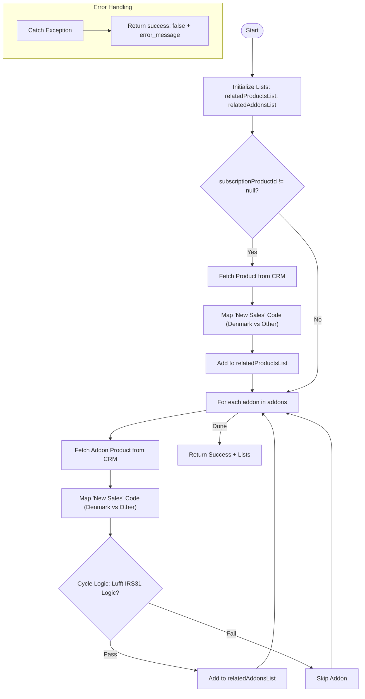

**Postman Documentation:** [Link to API Collection Placeholder]

---

## Overview
The `delugeConversionCustomPricingHandler` script is designed to handle custom pricing logic and product code mapping during the subscription conversion process in the Cordulus ecosystem. Its primary role is to take a set of products and add-ons, look up their region-specific "New Sales" internal codes from the Zoho CRM Products module, and apply specific business rules regarding product eligibility based on the current subscription cycle (e.g., handling specific Lufft sensors).

## Technical Contract
- **Input:** 
    - `subscriptionProductId` (Int): The CRM ID of the main subscription product.
    - `subscriptionPrice` (String): The price to be applied to the main product.
    - `addons` (String/List): A collection of addon objects (ID, Price, Quantity).
    - `country` (String): The country identifier used to determine which product code to use (e.g., "Denmark").
    - `currentCycle` (Int): The numeric representation of the current subscription term.
- **Output:** A Map containing a `success` boolean, a `productsList` of mapped subscription data, and an `addonsList` of mapped addon data.
- **Primary Entities:** 
    - `Products` (Zoho CRM Module)

## Dependency Map
This script orchestrates the following internal functions and external services:

| Function / Service | Purpose | Criticality |
| --- | --- | --- |
| `zoho.crm.getRecordById` | Retrieves product metadata and subform codes. | High |

> [!NOTE]
> This script does not currently call any other custom Deluge functions. All logic is contained within this standalone handler.

## Logic Flow

## Core Logic Sections

### 1. Subscription Code Mapping
The script identifies the "New Sales" product code for the primary subscription. It iterates through the `Product_Codes` subform on the Product record. If the `country` parameter is "Denmark", it selects `Product_Code_Denmark`; otherwise, it defaults to `Product_Code_Other`.

### 2. Add-on Processing & Lifecycle Rules
The script iterates through the provided add-ons and performs similar code mapping. However, it introduces a specific business rule for the product **"Lufft IRS31 Pro: Annual Subscription (5+ Years)"**:
- If the product is *not* the 5+ Years variant, it is only processed if the `currentCycle` is 4 or less.
- If it *is* the 5+ Years variant, it is processed if the `currentCycle` is 4 or greater.

### 3. Response Construction
The final output is structured to be consumed by a conversion tool or a UI component, providing clear lists for both primary products and secondary add-ons with their calculated codes and pricing.

## Developer Notes

> [!IMPORTANT]
> This script performs a `zoho.crm.getRecordById` call inside a loop for every add-on. If a conversion involves a high volume of add-ons (e.g., > 20), this may lead to performance degradation or hit Zoho's integration limit.

> [!CAUTION]
> The parameter `addons` is defined as a `String` in the function signature but is iterated over as a collection. Ensure that the calling script passes this as a List of Maps or that Deluge's auto-casting is behaving as expected.

> [!TIP]
> The `Upcoming_Cycle_Pricing` is currently set to match the `Current_Cycle_Pricing`. If future logic requires price escalations (e.g., +5% per year), this is the section where those calculations should be injected.

## Change Log
- **2026-03-19T17:39:00.827Z:** Initial creation of documentation via DeluluDocu. Mapped logic for country-specific product codes and Lufft cycle-based filters.