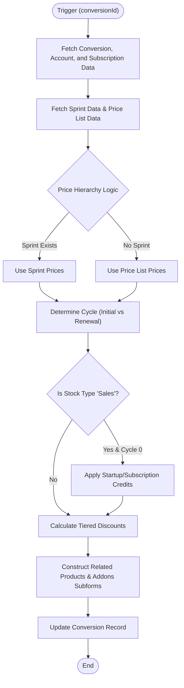

**Postman Documentation:** [Link to API Collection Placeholder]

---

## Overview
The `delugeConversionPricingHandler` is a central orchestration script responsible for calculating and applying complex pricing logic to "Conversion" records in Zoho CRM. It reconciles pricing data from two primary sources—Active Sales Sprints and Account-specific Price Lists—while accounting for subscription cycles, renewal dates from Zoho Billing, and specific business rules like "Stock Type" credits and tiered discounts.

This script ensures that the `Related_Products` and `Related_Addons` subforms on a Conversion record accurately reflect the financial terms agreed upon, which are then used for downstream invoicing and subscription management.

## Technical Contract
- **Input:** `Int conversionId` (The unique ID of the Conversion record in CRM).
- **Output:** `String` (The JSON response from the CRM update operation).
- **Primary Entities:** 
    - `Conversions` (Zoho CRM)
    - `Accounts` (Zoho CRM)
    - `Subscriptions` (Zoho Billing)
    - `Related_Price_List` (Custom Module)
    - `Sales_Sprints` (Custom Module)

## Dependency Map
This script orchestrates the following internal functions and external services:

| Function / Service | Purpose | Criticality |
| --- | --- | --- |
| [[delugeSalesSprintPricingHandler]] | Retrieves pricing overrides defined within a specific Sales Sprint. | High |
| [[delugePriceListPricingHandler]] | Retrieves standard pricing based on the account's assigned price list and country. | High |
| `Zoho Billing API` | Fetches subscription details using the `zohobillingconnection`. | High |

## Logic Flow

## Core Logic Sections

### 1. Data Context & External Fetching
The script identifies the organizational structure and retrieves the "Invoiced By" account to determine the applicable `Price List`. It fetches the subscription record from **Zoho Billing**. 

> [!NOTE]
> The script now includes fallback logic for the renewal date: it checks `next_billing_at` first, and if empty, falls back to `expires_at`. This ensures pricing logic remains valid for subscriptions set to cancel at the end of the term.

### 2. Pricing Hierarchy (The "Waterfall")
The script follows a strict priority order:
1.  **Sales Sprint:** If a sprint is active on the conversion, those prices take precedence.
2.  **Price List:** If no sprint exists or if the sprint doesn't define a specific price, the script falls back to the Price List.
3.  **Scheduled Price Changes:** The script checks if a `subscription_effective_date` exists in the Price List. If the renewal date is on or after this effective date, it applies the scheduled price.

### 3. Stock Type Credits
A specific business rule applies when `Stock_Type == "Sales"` during the initial cycle (`cycle == 0`):
- If a Sprint price is provided, the script calculates a "Credit" by subtracting the base Price List price from the Sprint price.
- It switches the Product Code to a "Credit Code" (e.g., `startup_product_credit_code`).

### 4. Tiered Discounting
Discounts are calculated based on the `Tiered_Discount` field on the Account.
- Discounts are **not** applied if Sales Sprint pricing is currently effective for that cycle.
- The discount is calculated against the "End User Price" and stored as a separate long integer value.

## Developer Notes

> [!IMPORTANT]
> The script contains a hardcoded `orgId = 20087400261` for Zoho Billing. If the Billing organization changes, this value must be updated.

> [!WARNING]
> The script uses a specific connection name `zohobillingconnection`. Ensure this connection has the `ZohoBilling.subscriptions.READ` scope authorized.

> [!TIP]
> The variable `cycle` determines if the product code should use the "Initial" code or the "Regular" code from the pricing handlers. `cycle == 0` is treated as the initial setup/conversion.

> [!TIP]
> The logic for `renewalDate` was updated to ensure that one-time or non-renewing subscriptions still calculate "Upcoming" pricing correctly by using the expiration date as the threshold.

## Change Log
- **2026-03-19T20:13:46.867Z:** Initial creation of documentation via DeluluDocu. 
- **Current Version:** Added logic to handle scheduled price increases and tiered discount exclusions for active sprints.
- **2026-03-31T07:05:38.279Z:** Updated data fetching logic for Zoho Billing subscriptions. Added a fallback condition for `renewalDate` to use `expires_at` if `next_billing_at` is an empty string, preventing null-pointer errors during date conversion for specific subscription states.